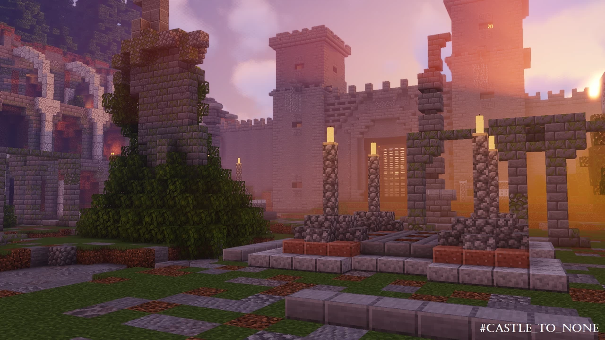

# Castle.None-城堡终焉

## 基本信息

**作者:** [Ash_47](https://www.planetminecraft.com/member/ash_47/)

**版本:** 1.14.4

**人数:** 3-6

**官方:** [PM](https://www.planetminecraft.com/project/castle-to-none/)

完整标签（点击展开）

完整中文标签: 
`Challenge`, `Bosses`, `BOSS战斗`, `Raid`, `Challenge Adventure`, `Encounters`

原始标签（点击展开）

原始英文标签: 
`Challenge`, `Bosses`, `Bossfight`, `Raid`, `Challenge Adventure`, `Encounters`

图片展示（点击展开）

## 介绍

### 城堡终焉：多人合作突袭地图

#### 🎮 游戏简介
《城堡终焉》是一款支持**3-6人合作**的突袭类地图，灵感源自《命运2》的副本设计，并完美融入《我的世界》的开放世界。玩家将潜入被怪物盘踞的古堡，通过团队协作突破层层关卡，最终揭开城堡深处的秘密。

---

#### ✨ 核心特色
- **职业系统**  
  * 游侠：配备弩箭与爆炸箭，命中可减速敌人，单挑能力出众  
  * 守卫：持盾职业，拥有最高伤害抗性与生命值，可制作提供减伤效果的炖菜  
  * 支援：治疗专精，可驱散减益状态，提供火焰抗性，生命恢复速度更快  

- **动态奖励**  
  采用随机掉落系统，包含**护身符**、**盔甲**与**武器**三类装备  

- **进阶挑战**  
  内含成就系统与隐藏挑战，适合追求极限的玩家  

- **策略攻坚**  
  关卡设计注重团队配合与战术调整，需通过反复尝试寻找最优解法  

---

#### ⚙️ 配置要求
**运行环境**  
- Minecraft 1.14.4 原版服务端  
- 需安装Optifine以完整显示视觉效果  
- 推荐使用64位Java环境  

**画面设置**  
- 云层：关闭  
- 动态光照：开启（推荐高品质）  
- 渲染距离：10区块以上  
- 粒子效果：全部开启  
- 亮度：100%  
- 着色器：可用但可能影响亮度（不推荐）  

---

#### 🛠️ 安装指南
**主机端配置**  
1. 下载CTN1.14.4压缩包  
2. 解压后将地图文件放入服务端「saves」文件夹  
3. 将资源包「CTN」置入客户端resourcepacks目录  
4. 启动游戏加载资源包  

**客户端配置**  
1. 按上述步骤安装资源包  
2. 加入已配置好的服务端  

> ⚠️ 注意：局域网联机可能存在稳定性问题，建议使用专用服务端

---

#### 📜 注意事项
- 游戏开始后无法中途加入新玩家  
- 战斗中离线的玩家仅可在当前战斗阶段重连  
- 严禁使用指令，可能破坏命令方块系统  
- 建议按L键查看成就进度  
- 职业特性可通过物品栏悬停提示查看  
- 首场战斗可能出现帧率下降（Minecraft引擎限制）  

---

#### 🌟 特别鸣谢
**测试团队**  
Reaper、Chocopanda97、Senpai、Frac、NeRv 等全体测试成员  

**素材来源**  
- 树木模型：Exsilit 作品集  
- 国王雕像：Ukcal 创作  

---

#### 🔗 社区支持
**最新更新**  
- 已修复1.0版本复活机制异常  
- 新增「纯净模式」挑战选项  
- 详细图文攻略：[点击查看](drive.google.com/file/d/1DRYessLfrUp6_VFk0TK6wIRQHD9g579N/view)

**参与互动**  
[加入Discord社区](https://discord.gg/TsDjRpJeMR) | [投票选择下个副本主题](https://www.strawpoll.me/20520000)

---

> 地图版权归 Ash 与 ChaoticImme 所有，转载需获授权。录制视频请在说明标注创作者信息及原帖链接。祝您游戏愉快！🎉

原始介绍(点击展开)

NEW UPDATE AS OF JULY 2023: PURIST MODE HAS BEEN ADDED TO THE GAME, ENABLE THE MODIFIER IN THE LOBBY TO PLAY THE CHALLENGE.UPDATE: VERSION 1.0 HAD A BUG WITH THE RESPAWN, AND IT HAS BEEN FIXED, IF YOU CANNOT REVIVE YOUR FRIENDS, DOWNLOAD THE UPDATED VERSION.JOIN OUR DISCORD FOR MORE: https://discord.gg/TsDjRpJeMR DESCRIPTION:Castle To None is a 3-6 player cooperative raid map, inspired by Bungie's Destiny 2 raid designs and adapted into the Minecraft world. - Infiltrate an old castle haunted by monsters and survive all encounters. - Three distinct classes to play (Ranger - Defender - Support).- Randomized loot table system (Charms - Armor - Weaponry).- Advancements, challenges, and achievements if you're up to the task.- Encounters will not solved from the first try, you will need to improvise and go through trial and error to eventually succeed.LEGAL INFORMATION:Castle To None is a map and property of Ash and ChaoticImme. Do not re-upload or alter the project without direct permission from either owners. YOU MAY NOT RE-UPLOAD THIS ON A SEPARATE MAP WEBSITE.If you would like to record Castle to None game-play, make sure you include the map's main page on planet minecraft and both names of the owners in the video description "Created by Ash and ChaoticImme."MINECRAFT VERSION: 1.14.4 OPTIFINEMAKE SURE YOU HAVE OPTIFINE OR MANY VISUAL FEATURES WILL NOT BE VISIBLE.The map will not function properly or won't work at all in any different versions.REQUIREMENTSMinecraft version 1.14.4 with optifine installedMinecraft Vanilla server Co-op 3-6 players (you CANNOT play this map less than 3 or more than 6)64 bit java (reccomended)MAKE SURE YOU INSTALL AND LOAD THE RESOURCEPACK DEDICATED TO CASTLE TO NONEDifficulty: Normal - HardSETTINGSClouds: OFFDynamic Lighting: ON (fast/fancy)Render Distance: 10+ chunksparticles: ALLShaders can be used but not advisable (could hinder the brightness)brightness: Bright (100%)Music: Recommended to keep on as there are custom tracksADDITIONAL INFORMATIONOnce the game begins, you may not add more players. If one player leaves during an encounter, he may come back but only during the encounter, he may not rejoin during later encounters.Do not type any commands as the map is very complex and simple lines of code can ruin the whole command block system.Playing on LAN is not advisable, use a vanilla server instead.I highly advise you check the achievements and advancements by pressing the 'L' key.Make sure you read your class's description, if you want to know what an item does, hover over it from your inventory.Apologies to the fps drops on the first encounter, that is a minecraft-related issue but it's not too severe. (hopefully)CLASSES:1- Support: Healing class, can remove debuffs and grant fire resistance, primary weapon can be used both in melee and ranged combat with right-click, faster health regeneration.2- Defender: Has a shield, can produce the highest damage output, has stew that provides damage resistance, and a higher overall health.3- Ranger: Crossbow, explosive arrow (right-click to engage in crossbow), slows enemies when hit, best duelist class.SERVER (Vanilla server recommended)enable-command-block=trueallow-flight=truedifficulty normal or hardpvp=falseHow to Install if you will host the map (server)1- Download CTN1.14.4 2- Extract CTN1.14.4, inside there will be a file, another compressed file (zip), and a notepad.3- move the file to the "saves" directory on your vanilla server.4- move the compressed file "CTN" to the resourcepack in your minecraft files.5- run minecraft and change the resourcepack from default to the CTN one.6- press done and you're good to go.How to install if you're a client1- Download CTN1.14.42-extract CTN1.14.4, inside there will be a file, another compressed file (zip), and a notepad.3- place the compressed file to the rosourcepack in your minecraft files.4- run minecraft and change the resourcepack from default to the CTN one.5- press done and you're good to go.Special Thanks to our beta testers: Reaper, Chocopanda97, Senpai, Frac, NeRv, Miedo, Wicked, The_Iron_M, Cookie_Cyclone, Ocelot, ShadowReaper, Lonely, Crimson_rebel, Lem0n_Ju1ce, sralsaeed, FORTNITEISSTUPID, Arsalan2356Sorry if I missed anybody, let me know in the comments if you actually did take part in the beta tests. x(Schematics taken from:Trees: Exsilit - www.planetminecraft.com/project/tree-bundle-370-custom-trees-download/King Statue: Ukcal - www.planetminecraft.com/project/king-statue/UPDATE: Hey everyone, I hope you're enjoying Castle To None, if you would like to vote for the upcoming raid map, click on the link https://www.strawpoll.me/20520000 Created by Ash and ChaoticImme, goodluck!UPDATE 2: Hi all, in case any of you are stuck in any encounter, here's an in-depth text guide that can help you out, goodluck! LINK TO GUIDE: drive.google.com/file/d/1DRYessLfrUp6_VFk0TK6wIRQHD9g579N/view?usp=sharing

## 相关实况

暂无相关实况信息

## 游玩截图

暂无游玩截图
