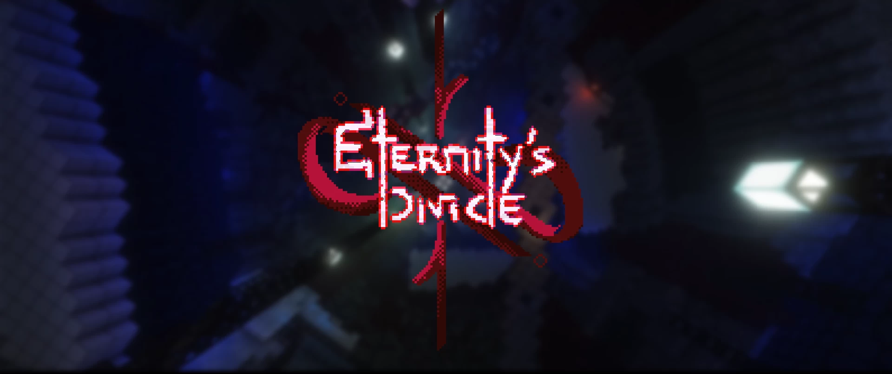

# Eternity.Divide-永恒裂隙

## 基本信息

**作者:** [Ash_47](https://www.planetminecraft.com/member/ash_47/)

**版本:** 1.20.4

**官方:** [PM](https://www.planetminecraft.com/project/eternity-s-divide-1-6-player-map-destiny-2-inspired-raid/)

**人数:** 1-6

<details>
<summary>完整标签（点击展开）</summary>
完整中文标签: 
`雪地`, `Snowy`, `Pve`, `Robots`, `Machine`, `Alien`, `Robot`, `自定义地图`, `Destiny`, `Raiding`, `Raid`, `Challenge Adventure`, `Destiny2`, `Snowbase`, `Destinythegame`, `突袭地图`
</details>

<details>
<summary>原始标签（点击展开）</summary>
原始英文标签: 
`Snow`, `Snowy`, `Pve`, `Robots`, `Machine`, `Alien`, `Robot`, `Custommap`, `Destiny`, `Raiding`, `Raid`, `Challenge Adventure`, `Destiny2`, `Snowbase`, `Destinythegame`, `Raidmap`
</details>

<details>
<summary>图片展示（点击展开）</summary>

</details>

## 介绍

#### 🎮 版权声明与使用规范
- **地图归属**：本作品由 **Ash** 与 **ChaoticImme** 联合创作，受版权法保护
- **转载禁令**：禁止在任何第三方平台重新上传或修改本作品
- **录制须知**：录制实况时需在简介标注创作者信息："Created by Ash and ChaoticImme"，并附上官方发布页面链接（MinecraftMaps/CurseForge/PlanetMinecraft/Ko-fi/MCBBS/StickyPiston）
- **原创保护**：所有机关设计、剧情架构、谜题机制、脚本系统均属原创，禁止以近似形式复用于其他项目
- **商用授权**：任何组织或个人未经书面授权不得将本作品内容用于商业用途

---

### ⚙️ 游戏设置指南

#### 影像设置
- **难度选择**：简单~普通（禁用和平模式）
- **渲染距离**：16-32区块
- **模拟距离**：16-32区块  
- **界面缩放**：3倍（全屏体验更佳）
- **画质选项**：
  - 图形品质：极致（使用光影时除外）
  - 粒子效果：全部开启
  - 平滑光照：开启
  - 天气效果：默认/精致

#### 音效设置
- **主音量**：25%-50%
- **背景音乐**：50%（建议）
- **生物音效**：敌对/友好生物均需100%
- **环境音效**：65%-90%
- **定向音频**：关闭（关键设置）

---

### 🛠️ 客户端配置

#### 启动器设置
- **内存分配**：最低4GB，推荐8GB
- **游戏版本**：**1.20.4**（版本错误将无法运行）
- **模组加载**：Fabric + Sodium（强烈推荐）
  - 下载链接：
    - fabric-api-0.97.2+1.20.4
    - sodium-fabric-0.5.8+mc1.20.4

#### 可选模组
- **联机工具**：Essentials（需所有玩家安装，主机掉线将中断连接）
- **光影组件**：Iris（建议禁用黑框效果以免影响界面）
- **资源包**：将`Eternitys_Divide_Resource_Pack`放入资源包文件夹

---

### 🌐 服务器配置

#### 核心参数
```properties
broadcast-console-to-ops=true
broadcast-rcon-to-ops=true
level-name=Eternity's Divide
simulation-distance=18-28
view-distance=24-32
function-permission-level=3
```

#### 运行配置
- **内存要求**：最低4GB，推荐8GB
- **启动命令**：`java -Xmx8G -jar [服务端核心].jar nogui`
- **版本匹配**：必须使用1.20.4版本

---

### ✅ 实测可用平台

#### 推荐方案
- **本地开服**：最佳体验，需提前配置端口转发
- **Essentials**：点对点联机，适合3-4人游戏
- **Lunar启动器**：需手动禁用永久亮光设置
- **Playit.gg**：无需端口转发的隧道服务
- **Exaroton**：付费但稳定的托管服务

#### 不推荐方案
- E4MC托管模组：连接稳定性欠佳
- Forge+Optifine：可能引发模型显示异常
- 原版启动器：帧数表现较差
- Bukkit/Paper：完全无法运行

---

### 📥 安装教程

1. 下载`ED_V_any_mc_v1.20.4.zip`压缩包
2. 解压至`.minecraft`文件夹（通过运行→appdata→roaming访问）
3. 启动游戏并启用ED资源包

---

### 👥 制作团队

#### 核心创作
- **Crimsy**：概念设计/视觉艺术/剧本创作
- **ChaoticImme**：原创配乐/特效制作
- **Ash**：音效设计/预告片制作

#### 特别鸣谢
- **配音演员**：SralSaeed
- **测试团队**：barasel321、Blackmagicmen、NotZiad等成员
- **截图支持**：Isshiko

#### 技术资源
- **数据包**：snavesutit、bigpapi、bradleyq等开发者
- **音源库**：Pixabay、Freesound.org、Mixkit等平台

---

### 💝 支持我们

如果喜欢本作品，欢迎通过[Ko-fi](https://ko-fi.com/ashash47)支持创作者持续开发！  
**谨记**：本作品由Ash与ChaoticImme倾力打造，请尊重原创精神。

🎉 祝您在《永恒分界》的冒险旅途中收获精彩体验！

<details>
<summary>原始介绍(点击展开)</summary>
LEGAL:,Eternity's Divide is a map and property of Ash and ChaoticImme. Do not re-upload or alter the project. YOU MAY NOT RE-UPLOAD THIS ON A SEPARATE MAP WEBSITE.If you would like to record the map game-play, make sure you include the map's main page on MinecraftMaps, curseforge, planetminecraft, ko-fi, MCBBS, or stickypiston including both names of the owners in the video description "Created by Ash and ChaoticImme."All original mechanics, encounter design, scripting, lore, puzzle architecture, and gameplay structure within Eternity’s Divide are original creations of Ash and ChaoticImme. While inspired by the broader genre of MMO-style raids, all creative implementations are protected under copyright law.Unauthorized reproduction, replication, or commercial use of any encounter or mechanic with almost the exact settings (including but not limited to their structure, triggers, unique gameplay loops, and scripted sequences) is prohibited.This includes incorporation of our content into other games, mods, or commercial projects without our explicit written permission.This also applies to studios, developers, and corporate entities.------------------------------------------------------------------------------------------This section is for In-game settingsA. VIDEO SETTINGS:General:Difficulty: Easy - Normal (DO NOT PUT PEACEFUL OR THE MAP BREAKS)Please do not use Left handed optionRender Distance: 16 - 32 Chunks Simulation Distance: 16 - 32 ChunksBrightness: Moody (Recommended) - 50%GUI Scale: 3x (RECOMMENDED, PLAY ON FULLSCREEN AS WELL)Quality:Graphics: Fabulous! (Unless you are using shaders) Particles: AllSmooth lighting: ONWeather: Default (Recommended) / FancyB. Music & Sounds:Master Volume: 25%-50% (Recommended)Music: 50% (preference)Hostile Creatures: 100% (Required)Friendly Creatures: 100% (Required)Players: 80-100% (Required)Ambient/Environment: 65%-90% (Recommended) Directional Audio: OFF (IMPORTANT)This section is for client pre-launch / local files settings:A. Launcher:1.Memory Allocation: 4 GB Minimum - 8 GB Recommended2.Version: 1.20.4 (IMPORTANT, MAP WILL NOT RUN IF WRONG VERSION)3.Modded?: Fabric + Sodium (HIGHLY RECOMMENDED, YOU WILL NEED A LOT OF PERFORMANCE TO RUN THIS MAP, DOWNLOAD THESE TWO MODS AND USE THE INSTALLER, IT'S VERY STRAIGHTFORWARD, ONCE YOU ARE DONE, SELECT THE RELEASE THAT INCLUDES FABRIC, LINKS ARE DOWN BELOW)Optional Launchers: Lunar, I tried Lunar for one run and it works great, just disable a lot of unnecessary options that Lunar provides and disable full-bright settings.B. Local Files:Recommended Mods: Fabric + Sodiumfabric-api-0.97.2+1.20.4 modrinth.com/mod/fabric-api/versions?g=1.20.4sodium-fabric-0.5.8+mc1.20.4 modrinth.com/mod/sodium/versions?g=1.20.4Optional Mods:Essentials: (If you do not want to host a server locally or use an online host, you can go with Essentials, Please note that Essentials has a risk of booting all other players in the lobby if the host leaves, Enable Cheats and invite your friends, all other players must have Essentials. DOES NOT WORK ON OFFLINE / CRACKED ACCOUNTS)Shaders: Iris, pick any shader you like, just check if the shader has an option to disable the black frames from showing so it doesn't hinder your HUDResource Packs: Be sure to put Eternitys_Divide_Resource_Pack in the resource pack folder, how do you locate the folder? Open Minecraft launcher, go to options -> Resource Packs -> Open Pack Folder and drop the folder there.C. Server / Multiplayer:Server Properties:broadcast-console-to-ops=true (important for worlds 1st)broadcast-rcon-to-ops=true (important for worlds 1st)gamemode=survival/adventurelevel-name=Eternity's Divideonline-mode=true (if all accounts are premium)Simulation-distance=18 Recommended - 28view-distance=24-32, 32 Recommendedfunction-permission-level=3Server RAM:run.bat: java -Xmx8G -jar [​SERVERLOADERNAMEHERE].jar nogui(8 GB RAM is recommended, 4 GB is minimum, any lower and the server will crash) Version: 1.20.4 (IMPORTANT OR MAP WILL NOT RUN!!!)Eula: Be sure to set this to true or the server will not run!----------------------------------------------------------------------------------- Servers / mods / launcher that I tried and work:Local hosting (Best, you basically have your own server and can adjust things as you please, downsides is that it can eat out your RAM if you are running a server on the same PC you use to play, but it's not bad if you have 16 GB RAM, be sure to know how to port-forward your server beforehand!!!)Essentials (Second best, basically a mod that provides a peer-to-peer connection, you basically put your map on saves instead of a server and just invite your friends, downside is that everyone needs to have the mod in order to get into your game. Also, if you crash or disconnect, the rest of the players will be booted off. I haven't tried this for 5-6 players, so I can safely say that it's really good with 3-4)Lunar Launcher ( Really good launcher, run it via Fabric + Sodium and disable the unnecessary features, most importantly disable the perma-light setting, I didn't see any bad downsides aside from having to manually remove anything you don't need)Playit.gg (Tunneling service, super easy to set up for those who cannot port forward nor use essentials, regsiter to it and set up your server, the IP will get tunneled to one where players can connect to your server, think of it as a very convenient Tunngle or LogmeinHamachi. I didn't try this with 5-6 players so I'm not sure how it works)Exaroton (Chaotic's comfort pick, downside is that you need to pay to use the services, but it's quite cheap and reliable. We had a few issues running the map but it has been optimized since)-------------------------------------------------------------------------------Servers / mods / Launchers That I didn't try / do not work / do not recommendE4MC hosting mod: Very weird, sometimes it works, sometimes it doesn't, I do not reccomend itForge + Optifine (I didn't try it, but I prefer Fabric + Sodium since Optifine has a weird visual bug with custom made models)Vanilla Minecraft launcher (Bad idea, your FPS will suffer, I have a beefy PC and it dipped hard in some encounters, go for it if you are willing to lose frames)Bukkit / Paper (Does. Not. Work. Don't try.)a lot of other performance mods (Personally, Sodium should be enough, but if you want to try other performance mods, proceed at your own risk)--------------------------INSTALLATIONHow to Install1- Download ED_V_any mc_v1.20.4.zip.2- Extract the compressed ZIP archive into .minecraft folder, you can find this by typing "run" on windows search, type in "appdata" in the run 'Open:' , go to roaming, then .minecraft.3- Run minecraft and change the resourcepack from default to ED.------------------------------------------------------------------------Credits / special Thanks to: Crimsy: Concept Artist, Visual Artist, Logo design, Story writing, character design and script writingSralSaeed: Voice Actor (???)barasel321, Blackmagicmen, NotZiad, Crimsy, Reaper, Arsalan2356, Shrek: Beta TestingIsshiko: Screenshots for map gallery-----------------------------------------Datapacks: snavesutit for animated javabigpapi for delta datapackbradleyq for the lights datapackcloudwolf for wasd datapackpucksilver for noshadow shaderSchems taken from PlanetMinecraftMusic: Original Soundtrack, composed by ChaoticImmeSFX resources: Pixabay, Freesound.org, Pond5.com (subscription required), Mixkit, Zapsplat, freesfx, arranged and composed by AshVFX: Original, by ChaoticImmeTrailer: Created by Ash--------------------------------Donate? if you'd like to support us feel free to buy us a ko-fi, enjoy the map! :) ko-fi.com/ashash47Created by Ash and ChaoticImme. Support Ash_47 on Ko-fi! ❤️. ko-fi.com/ashash47</details>

## 相关实况

暂无相关实况信息

## 游玩截图

暂无游玩截图
