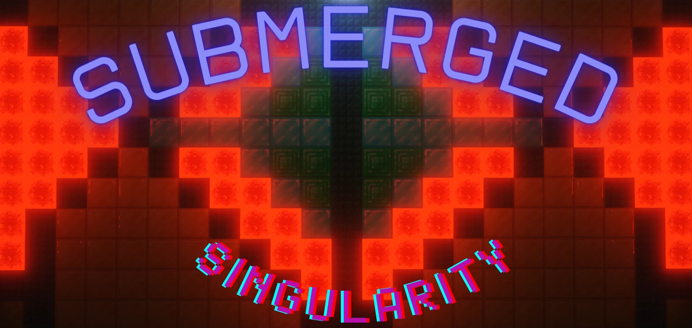

# Chronicles.of.Light.Submerged.Singularity

# 光明编年史.沉没奇点

## 基本信息

**作者:** [Darkknight3227](https://www.planetminecraft.com/member/darkknight3227/)

**版本:** 1.21.3

**官方:** [PM](https://www.planetminecraft.com/project/1-21-3-chronicles-of-light-submerged-singularity-custom-minecraft-raid-adventure-map/)

完整标签（点击展开）

完整中文标签: 
`Adventure`, `Pve`, `Underwater`, `Destiny`, `Raiding`, `Raid`, `Challenge Adventure`, `Destiny2`, `Destinythegame`, `突袭地图`

原始标签（点击展开）

原始英文标签: 
`Adventure`, `Pve`, `Underwater`, `Destiny`, `Raiding`, `Raid`, `Challenge Adventure`, `Destiny2`, `Destinythegame`, `Raidmap`

图片展示（点击展开）

## 介绍

### 光影纪事：沉没奇点

#### 🌊 故事序幕
**神圣召唤**已然降临——你的神明正在呼唤你！黑暗势力正因未知缘由包围着他所在世界的实验室。同事间的低语指向人类世界的一座**水下科技设施**，而你被派遣去调查那里传来的紧急求救信号。但当双脚踏入站台的那一刻，你骤然意识到——**一切表象之下暗藏玄机**。

> 这里孕育过某个计划——并非执行，而是真正意义上的孕育、诞生与滋养

#### ✨ 核心特色
- **四大职业系统**搭配进阶能力
- 蕴含**团灭机制**的首领战与遭遇战
- 深度打造的**背景史诗**
- 首次通关后解锁：
  * **玩家人数覆盖**模式
  * **战利品调节器**
- 强调**试错探索**——首次挑战必然无法轻易突破！

#### 🎵 创作鸣谢
**核心组件**
- DanMizu：生命指示数据包
- Divano：首领血条代码
- BigPapi13 & MulverineX：动态移动系统
- Moulberry：Axiom框架

**影音资源**
- David Fesliyan（主题音乐）
- Lena Raine（Rubedo曲目）
- Freesound与Pixabay音效库
- BDEngine全系列方块展示

**特别致谢**
- Ash与ChaoticImme：开创性地图系列的灵感源泉
- Jxtrf与Ash：项目推动者
- AudreyTheKitty与onesmallfox：测试与反馈

#### 🎮 运行配置
**强制要求**
- 游戏难度：除和平模式外任意（推荐普通）
- 渲染与模拟距离：12+（推荐16+）
- 粒子效果：全开
- 平滑光照：开启

**音效设置**
- 主音量：50-75%（建议）
- 背景音乐：关闭
- 唱片机/音符盒：25-50%（录制视频时请关闭）

**进阶优化**
- 着色器：Solas 2.8b / BSL
- 运行环境：Fabric+Sodium组合
- 内存分配：建议手动配置
- 服务器：严格使用原版服务端

> 💡 由于地图采用大量粒子与实体，推荐使用独立服务器规避卡顿

#### ⚠️ 重要须知
**音乐版权**
- 作曲家David Fesliyan的曲目虽可免费使用，但可能触发内容识别系统
- 视频制作请务必在描述栏标注版权信息
- 欢迎在视频描述中附上任意平台的地图页面链接

**授权声明**
- 禁止未经许可的二次发布或修改
- 严禁盗用创作成果

#### 🔧 已知问题
目前存在**多人同时阵亡**时，若存活玩家复活其中一人，其余玩家的复活标记将消失且无法被复活。该问题修复补丁已部署，但尚未完成全面测试。

---

📥 **联机交流**：欢迎加入[开发者Discord](discord.gg/TsDjRpJeMR)寻找队友与最新动态

原始介绍(点击展开)

"A plan was hatched here - not enacted - hatched. Birthed. Nurtured."Chronicles of Light: Submerged Singularity is a map inspired by Destiny 2’s raid and dungeon activity instances, best with 3+ players, though possible to complete by yourself. A divine summons has been issued — your god calls upon you. Dark forces are surrounding the laboratory in his home-world for an unknown reason. Whispers among your coworkers indicate an aquatic technological facility in the human world, and you are sent to investigate the sudden distress calls permeating from there. But right as your boots hit the station’s floor, almost immediately it occurs to you…Nothing is as it seems.Features:-4 classes with upgrades-Bosses and encounters with wipe mechanics-Very detailed lore-Additional modifiers after first full completion such as Player Count Override and Loot Modifiers!Encounters will not be solved on the first try, thus, trial and error are crucial to success!Trailer Music:youtu.be/r9uV7rjM5Ec?si=5fDY6NtZD3_PO3K3Credits:DanMizu for their Health Indications datapack.Divano for the bossbar code.BigPapi13 for the original delta datapack, MulverineX for updating it as Player Motion.David Fesliyan (fesliyanstudios.com) for the music used in this map as well as Lena Raine for Rubedo.Moulberry for Axiom.SFX from Freesound and Pixabay.Block Displays (all found at BDEngine!):GabrielPlay_XD_XaissSmailBlocksTexacowNanChikLord_HonoriaSpecial Thanks:Ash and ChaoticImme for creating their saga of maps that inspired this to begin with (please check those out if you haven’t! (www.planetminecraft.com/member/ash_47/)Jxtrf and also Ash for coercing me into this project.AudreyTheKitty and onesmallfox for playtesting and giving useful feedback.[​Important Note about Music]Credit: www.FesliyanStudios.com Background MusicThe music used in this map by David Fesliyan is royalty free, however it will also cause your video to be copyright claimed through the ID system. If this is a problem, you can turn the music off by turning the Jukebox/Note Blocks slider in the music settings to 0%. Your channel should not be striked either way.To credit the composer, write/copy the credit statement at the top in the description. It is also included in the credits.txt file that shipped with the map.Here is a link to their policy page if you want to know more.Side note: I recommend that slider be around 25-50% during gameplay if you are keeping music.If you are recording a YouTube video, I only ask that you link the map page (it can be any map page from Planetminecraft, MinecraftMaps, etc.) in your YouTube description.Under no circumstances are you allowed to repost the map on a separate website without explicit permission. This also goes for altering the map. You are also not allowed to steal this work and claim it as your own.[​Minecraft 1.21.3]Difficulty: Anything except Peaceful or the map will break (I suggest Normal).Render and Simulation Distance: 12+ (though 16+ is the recommendation).Particles: All (very important).Smooth lighting: ONMaster Volume: Personal preference (I usually use 50-75%).Music: OFFJukebox / Note Blocks: 25-50% (OFF if you are recording for YouTube, unless you don't care about getting copyright claimed).Resource Pack is not explicitly required, although there will be custom sounds that will be missing otherwise if you are not using it.[​OPTIONAL] Shaders: BSL, Solas (highly recommend Solas, but BSL is also very good).Update 07/12/25 - Solas is still very much recommended. However, I do not recommend you use the 2.8c or 2.9 versions, as 2.8c breaks the custom particles and 2.9 is extremely blinding in most segments. I highly recommend using 2.8b instead as I think it looks the best for this raid.I would also recommend Fabric, Sodium, + any other optimization mods of your choosing since this map is very particle-heavy and uses a lot of entities.That being said, this map does need a decent computer with solid processing power. Allocate RAM if you need to. If this is not the case, I recommend an external server to reduce/eliminate TPS lag.If you are using a server, do make sure it uses Vanilla and NOT Bukkit / Paper / etc, as this will most likely break the map.On another note: Ash and ChaoticImme were also nice enough to host the download on their Discord! I’ll leave it here so you can find me there and also potentially find teammates to play with. This is likely where I will be until the potential next map (once again, do check out their maps!)discord.gg/TsDjRpJeMRKNOWN ISSUES:-There is an issue where if multiple players die simultaneously and a living player revives one, all other players’ revive markers disappear and they can’t be revived. A fix should be applied for this but it hasn’t been fully tested.

## 相关实况

暂无相关实况信息

## 游玩截图

暂无游玩截图
