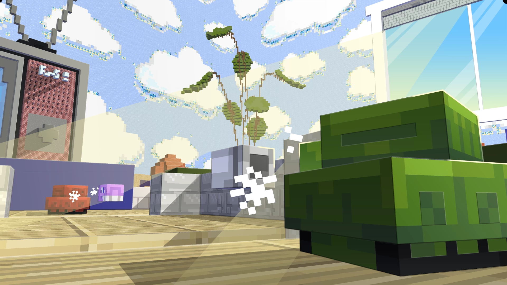
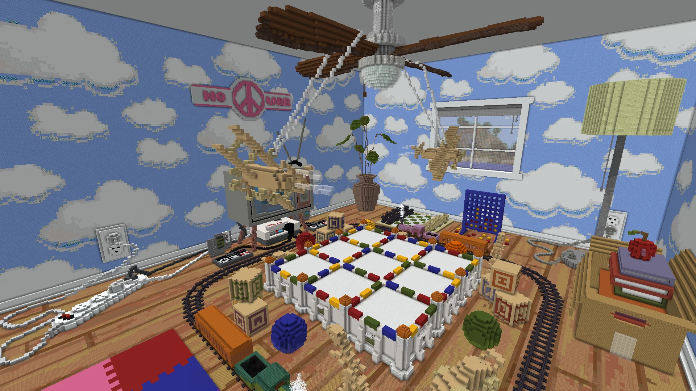

# Toy.Tank.Royale-玩具坦克大逃杀

## 基本信息

**作者:** [Flamingosaurus](https://www.planetminecraft.com/member/flamingosaurus/)

**版本：** 1.21.10

**支持人数：** 1-64

**地址:** [PM](https://www.planetminecraft.com/project/toy-tank-royale-pvp-minigame/)

图片展示（点击展开）

## 介绍

### 玩具坦克大逃杀

欢迎来到**玩具坦克大逃杀**！这是一款充满童趣与竞技的多人对战游戏，让你在迷你坦克的世界中展开激烈角逐。无需安装任何模组，即可体验纯粹的**100%原版** Minecraft Java 1.21.5 乐趣！

#### 🎮 游戏简介

- **核心玩法**：这是一款 **.io风格** 的 PVP 游戏，玩家将操控可爱的迷你坦克与好友展开对决。
- **胜利目标**：通过战斗收集**金币**，积累最高数量即可夺得**皇家王冠**！
- **风险提示**：当坦克被击毁时，会掉落**一半金币**，务必谨慎行动哦 😉

#### ✨ 特色功能

- **玩家规模**：支持 **1至64名** 玩家同场竞技
- **游戏模式**：包含**8种**不同玩法，其中包含经典的**夺旗模式**等
- **智能竞技场**：动态变换的战场环境，会根据玩家数量自动调整规模
- **强化系统**：战场中散落着**12种独特能量道具**等待收集
- **AI对手**：最多可加入**64个电脑控制的坦克**
- **管理功能**：内置**管理员菜单**，可实时调整游戏参数

#### 🗺️ 开发历程

本作品最初为 **StickyPiston地图创作大赛2021** 而制作：

- **创作挑战**：各团队需在**7天内**完成支持8名玩家的多人地图
- **主题选择**：我们选择了 **"无尽"** 主题并荣获**总排名第三**
- **赛后优化**：
  - 将第一人称视角设为默认镜头模式
  - 新增电脑控制的机器人单位
  - 扩展了**7种游戏模式**
  - 大幅优化性能表现
  - 修复了已知问题

#### 📦 资源获取

- **整合下载**：世界文件已包含服务器资源包
- **独立下载**：也可单独获取资源包（v1.2.14版本）
- **免费试玩**：立即在服务器上免费体验 →
  https://trial.stickypiston.co/mapjam/toytankroyale2
- **历史版本**：旧版地图可在 CurseForge 平台找到：
  https://www.curseforge.com/minecraft/worlds/toy-tank-royale

#### 👥 制作团队

- **美术设计**：Frenderman
- **建筑创作**：MCFilms  
- **程序开发**：Flamingosaurus

---

准备好驾驶你的玩具坦克，在这个充满惊喜的竞技场中展现你的战斗技巧吧！🎯🚀

原始介绍(点击展开)

Resource pack for servers is included with the world download, but you can also grab it here (v1.2.14)Want to play Toy Tank Royale for free on a server?https://trial.stickypiston.co/mapjam/toytankroyale2For Minecraft Java 1.21.5(100% vanilla, no mods needed)About:Toy Tank Royale is a .io-style PVP game where you battle your friends in cute little tanks.Get the highest amount of coins to claim the Royale Crown.Beware though... when you die, you drop half your coins!Features:Support for 1-64 playersAsynchronous gameplay8 game modes, including favorites like Capture the FlagDynamic arena, transforms around you and suits the player count12 unique power-ups to collect on the battlefieldAI tanks (up to 64 of them!)Admin menu to adjust game settings on the flyCredits:Art -- FrendermanArchitecture -- MCFilmsProgramming -- FlamingosaurusMap Jam?This map was originally made for the StickyPiston Map Jam 2021. Each team had 7 days to create an 8-player multiplayer map with one of four themes. We choose the theme "endless" and placed 3rd overall.Changes made after the map jam:Made first-person the default camera settingAdded computer-controlled botsAdded 7 game modesSignificantly optimized performanceFixed bugsOlder map versions can be found athttps://www.curseforge.com/minecraft/worlds/toy-tank-royale

## 相关实况

[联壁计划 Toy Tank Royale 皇家玩具坦克大战官方预告片][https://www.bilibili.com/video/BV1jX4y1S7C7/?share_source=copy_web&vd_source=74b861a52a5ce30367ddb461ed1112ee]

## 游玩截图

暂无游玩截图
