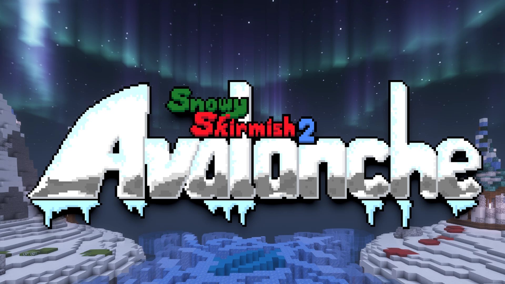

# Snowy.Skirmish.2.Avalanche-雪地冲突2.雪崩

## 基本信息

**作者:** [ZeroniaServer](https://www.planetminecraft.com/member/zeroniaserver/)

**版本:** 1.21.9

**官方:** [PM](https://www.planetminecraft.com/project/snowy-skirmish-2-avalanche/)

完整标签（点击展开）

完整标签: 
`Building`, `Ice`, `雪地`, `Snowy`, `迷你游戏`, `Fort`, `Santa`, `Winter`, `Christmas`, `Powerup`, `Snowman`, `Snowball`, `Igloo`, `Turret`, `Present`, `Sleigh`, `Challengeadventure`, `Challenge Adventure`, `Blizzard`, `Giftbox`, `Icebattle`, `Snowballfight`, `1.21地图`

原始标签（点击展开）

原始英文标签: 
`Building`, `Ice`, `Snow`, `Snowy`, `Minigame`, `Fort`, `Santa`, `Winter`, `Christmas`, `Powerup`, `Snowman`, `Snowball`, `Igloo`, `Turret`, `Present`, `Sleigh`, `Challengeadventure`, `Challenge Adventure`, `Blizzard`, `Giftbox`, `Icebattle`, `Snowballfight`, `121map`

图片展示（点击展开）

## 介绍

### ☃️ 雪域激战2：雪崩 ☃️

**制作团队：** Zeronia  
**游戏类型：** 多人对战  
**适用版本：** Minecraft Java版 1.21.9/10  
**当前地图版本：** v1.0.3  
**现已登陆 Minecraft Realms！**  

🎮 **游玩须知**  

- 需加载专用资源包方可体验完整内容  
- [点击此处下载服务器资源包](链接地址)  
- 对《雪域激战2：雪崩》或我们未来项目感兴趣？[立即加入 Zeronia Discord 服务器](链接地址)！

---

#### ❄️ 全新战略对决

欢迎来到《雪域激战》正统续作！本作颠覆前作模式，不再以收集礼物盒或击倒对手为得分重点，转而采用更具战略深度的战斗机制：

- **雪崩火箭**：击倒敌方玩家将使其掉落雪崩火箭  
- **地形破坏**：使用火箭轰击敌方基地后的山体，累积足够伤害即可引发**雪崩**  
- **胜利条件**：通过触发雪崩获取积分，终局时引发雪崩次数最多的队伍获胜！

---

#### 🎁 全面升级的能量道具

所有前作道具均完成视觉与机制重塑，不仅外观焕然一新，操作体验也更臻完美！我们取消了每人同时持有2个道具的限制，改为采用**道具冷却系统**。

**道具图鉴**：  

* ❄️ **冰霜球**：射程有限的强力投掷物，可一击制敌  
* ☕ **热巧克力**：饮用后快速恢复生命值，倒地玩家可使用它立即复活  
* ⛄ **雪人哨兵**：自动攻击附近敌人的友善雪人，会被雪球/冰霜球摧毁并随时间融化  
* 🌪️ **暴雪晶球**：创造减速风暴区域，敌人入内将受持续伤害，友军则获得雪球充能加速  
* 🗡️ **冰锥刃**：造成高额伤害与击退效果的近战武器  
* 🏕️ **治愈营火**：为周围玩家持续恢复生命值，并能复活范围内的倒地队友  
* 🛷 **雪橇载具**：大幅提升移动灵活性，点击跳跃键可实施高跳动作（无人乘坐或多次高跳后会损坏）  
* 🎁 **煤炭袜**：落地时产生致盲效果的战术道具  
* 🛡️ **雪垒方块**：可放置的防御工事，受雪球/冰霜球/雪崩火箭攻击即毁  

> ✨ Zeronia团队恭祝各位节日快乐！

---

#### ⚠️ 兼容性注意事项

以下模组/插件/服务器环境已确认存在兼容性问题，使用下列内容时出现的异常状况超出技术支持范围，为获得最佳体验建议避免使用：

- **界面修改类**：KronHUD、Better HUD 等自定义界面模组  
- **客户端优化**：Lunar Client、Badlion Client 等第三方客户端  
- **世界管理**：MyWorlds、Multiverse 等多世界管理插件  
- **模组冲突**：重度模组服务器（如与Pixelmon等大型模组同时运行）  
- **版本限制**：低于 1.21.9 的 Minecraft 服务器版本  

---

> 🎯 温馨提示：建议在纯净服务器环境中体验本作，尽享雪崩对决的极致乐趣！

原始介绍(点击展开)

☃️Snowy Skirmish 2: Avalanche☃️Made by ZeroniaMultiplayer, Minecraft Java Edition, Version 1.21.9/10Current Map Version: v1.0.3Now available on Minecraft Realms!A resource pack is required to play this game.Click here to download the server resource pack!Interested in Snowy Skirmish 2: Avalanche or our future projects? Join the Zeronia Discord Server!Welcome to Avalanche, the official sequel to Snowy Skirmish! In this game, your objective is no longer to collect the most giftboxes or knock out the most enemies for points. The game is now more strategic and combat-oriented.Knocking out enemy players will cause them to drop Avalanche Rockets. With these rockets, you can damage the mountains behind the enemy base, and if you do this enough times, you'll trigger an Avalanche.Avalanches are the new way for you to score points, and the team to trigger the most Avalanches by the end of the game wins.All powerups from Snowy Skirmish 1 have been reworked in terms of visuals and functionality. They now look and play better than ever before! We have also removed the 2-powerup per player restriction from Snowy Skirmish 1 in favor of item cooldowns.Happy Holidays from the Zeronia Team!Powerups:Ice Ball: A strong ice ball with limited range, capable of knocking out enemies with a single hit.Hot Chocolate: A consumable item; players can drink hot chocolate to quickly heal back some health, and knocked out players can use this to revive themselves.Snowman: A friendly snowman that fires bursts of snowballs at enemy players that get near it. They can be destroyed with snow and ice balls, and they melt over time.Snowglobe: Makes a stormy cloud where it lands. When enemies stand in its range, they'll get slowed down and take a lot of damage. When you stand in your own team's blizzards, you'll get snowballs much quicker.Icicle: Melee weapon used to deal a lot of damage and knockback to enemy players.Healing Campfire: A small campfire that heals nearby players. When knocked-out allies get near this, they'll be revived.Sleigh: Lets you quickly move around the map, making you harder to hit. Press your jump key to perform a big jump while riding a Sleigh. Sleighs break over time when nobody is riding them or after a couple of big jumps.Coal Stocking: Similar to a flashbang. Blinds nearby players wherever it lands.Snow Barricade: Placeable block. Breaks upon impact with Snowballs, Iceballs, and Avalanche Rockets.IMPORTANT: IncompatibilitiesThis is a list of mods, plugins, and server setups where Snowy Skirmish 2: Avalanche is either known or suspected to not function properly. Unfortunately, any problems that occur while using any of the following are beyond our control, and we recommend avoiding these for the most playable experience:- KronHUD, Better HUD, and any other custom HUD mods- Lunar Client, Badlion Client, etc.- MyWorlds, Multiverse, and any other world management plugins- Heavily modded servers (basically, don't run this with Pixelmon or whatever)- Servers running Minecraft versions prior to 1.21.9

## **相关实况：**

## [B站](https://www.bilibili.com/video/BV17vUuYDEtp/?spm_id_from=333.337.search-card.all.click)

## 游玩截图：

## 游玩人次：

