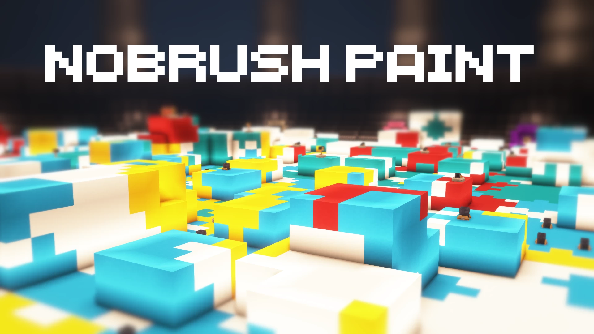

# Artistic.Paint-染色对决

## 基本信息

**作者:** [Neylz](https://www.planetminecraft.com/member/neylz/)

**版本:** 1.19.2

**官方:** [PM](https://www.planetminecraft.com/project/nobrush-paint-minigame/)

**人数: **4+

原始标签（点击展开）

原始英文标签: 
`Tower`, `Minigames`, `Minigame`, `Multiplayer`, `Strategy`, `Splatoon`, `Paintball`, `Paint`, `Turret`, `Challenge Adventure`, `Ressourcepack`, `3dmodels`, `Serverminigame`

图片展示（点击展开）

## 介绍

### 多人游戏注意事项
请务必下载配套资源包！服务器管理员可在配置文件中添加以下链接：
**资源包地址**：https://www.dropbox.com/s/qff302fh7tk83mz/NoBrush%20Paint%20RP.zip?dl=1

### 🎯 游戏核心玩法
在这款充满策略的迷你游戏中，**胜利的关键**在于用颜料覆盖尽可能多的地图区域！🚀
- 摒弃传统武器对抗，通过**精密布局**各类特殊工具实现领土扩张
- 运用智慧调配资源，用最少的操作实现最大面积的染色覆盖

### 🗺️ 游戏资源总览
#### 场景与阵营
- **精选地图**：5张风格迥异的竞技场
- **阵营选择**：12支特色鲜明的队伍

#### 🎨 战略要素
**阵营颜色选择将直接决定您的出生点位布局**！每个色系对应独特的战略地形，需要根据战局灵活选择。

### 🕹️ 新手指南
游戏内建有完整的教学系统：
- 所有操作指引与进阶技巧均整合于**进度菜单**（默认快捷键：L）
- 实时提示系统助您快速掌握核心机制

### 🛠️ 开发团队
**游戏设计**：Neylz  
**场景构建**：Unlifendd

---

💡 *温馨提示：建议首次游玩时完整阅读进度菜单中的指引内容，将显著提升游戏体验！*

原始介绍(点击展开)

Dont forget to download the Ressource Pack if you are playing Multiplayer !Link for server admins to put in resource-pack server.properties & download RP link : https://www.dropbox.com/s/qff302fh7tk83mz/NoBrush%20Paint%20RP.zip?dl=1Mini game in which the goal is to cover as much of the map with paint as possible; no weapons, it is the thoughtful placement of the various weapons at your disposal, which will allow you to expand and win!Minimum number of players: 2Recommended number of players: 4+.Maximum number of players : No limit ◔_◔5 maps at your disposal and 12 teams available.Choosing your team color matters; it determines your appearance point!In-game tips and starter guide in the advancements menu (default keybind: L).Dev by NeylzBuilds by Unlifendd

## 相关实况

暂无相关实况信息

## 游玩截图

暂无游玩截图
