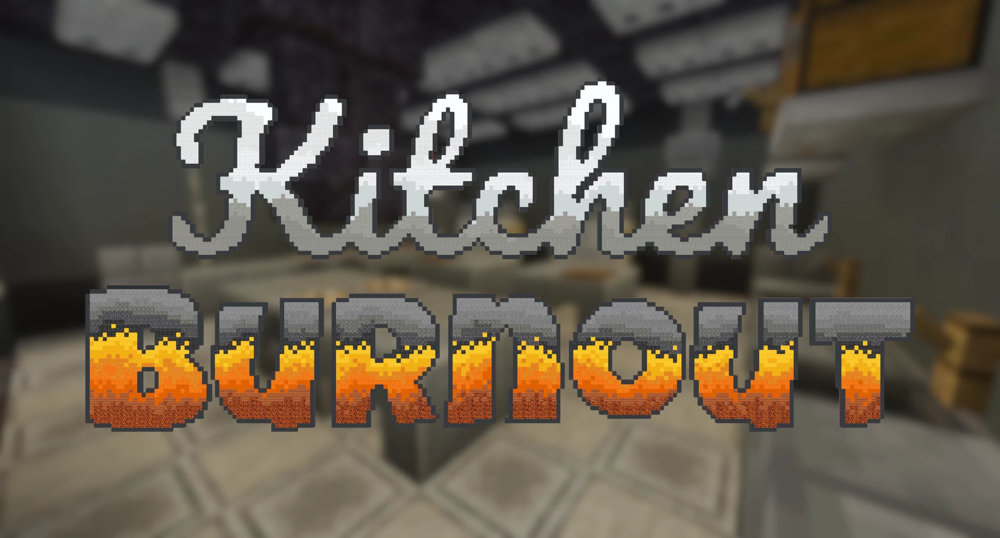

# Kitchen.Chaos-厨房大乱斗

## 基本信息

**作者:** [Command Realm](https://www.planetminecraft.com/member/command_realm/)

**版本:** 1.20.1

**官方:** [PM](https://www.planetminecraft.com/project/kitchen-burnout/)

**人数:** 1-4(个别玩法6+)

完整标签（点击展开）

完整中文标签: 
`Pvp`, `Command`, `Food`, `迷你游戏`, `Multiplayer`, `Kitchen`, `Realm`, `Realms`, `Speedrun`, `Chef`, `Cooking`, `Cook`, `Overcooked`, `Burnout`, `Other`, `Commandrealm`

原始标签（点击展开）

原始英文标签: 
`Pvp`, `Command`, `Food`, `Minigame`, `Multiplayer`, `Kitchen`, `Realm`, `Realms`, `Speedrun`, `Chef`, `Cooking`, `Cook`, `Overcooked`, `Burnout`, `Other`, `Commandrealm`

图片展示（点击展开）

## 介绍

### 厨房大作战：烹饪生存挑战

在《厨房大作战》中，要么成为顶尖大厨，要么被厨房的火焰吞噬！这是一场考验烹饪技艺与应变能力的极限挑战，你将面对永无止境的饥饿顾客队列，在危机四伏的厨房环境中制作令人垂涎欲滴的佳肴。

#### 🔥 核心玩法特色
- **极限厨房挑战**：穿梭于多个充满危险陷阱的厨房场景，在混乱环境中保持高效运作
- **多元美食制作**：掌握**汉堡**、**寿司**、**塔可**和**冰淇淋**等美食的烹饪艺术
- **竞争对抗模式**：与对手团队展开速度对决，只有最快完成订单的一方才能获得最终胜利
- **动态压力系统**：随着顾客需求不断升级，挑战你的多任务处理能力与抗压能力

#### 🌍 语言支持与版本信息
**支持语言**：
* 简体中文
* 英语
* 德语
* 日语
* 立陶宛语
* 俄语
* 乌克兰语

---

👨‍🍳 **致各位主厨**：愿餐叉与你同在，在炊烟袅袅的战场上谱写属于你的厨神传奇！

原始介绍(点击展开)

Cook or be cooked in Kitchen Burnout!Prove your cooking prowess in Kitchen Burnout! Navigate numerous challenging kitchens filled with dangerous hazards to create delicious meals for the never ending lines of hungry customers! Try your best to keep up with these chaotic conditions to be the best cook in this scenario where it truly is do or dine. Master the culinary arts behind burgers, sushi, tacos, and ice cream before the other team can to come out victorious! May the forks be with you, chef.​There is a recommended Resource Pack that is not required but greatly enhances the game's experience:https://github.com/CommandRealm/kitchen-burnout/releases/download/v1.1.0/Kitchen_Burnout_RP_v1.1.0.zipSupported Languages:EnglishSimplified ChineseGermanJapaneseLithuanianRussianUkrainianMinecraft Version 1.20.1© Command Realm, 2023Want to play Kitchen Burnout for free on a server?https://trial.stickypiston.co/map/kitchenburnout

## 相关实况

    
森山大马户9k

    <VideoPlayer platform="bilibili" idOrUrl="BV1RJ2KBdEtD" />

## 游玩截图

暂无游玩截图
