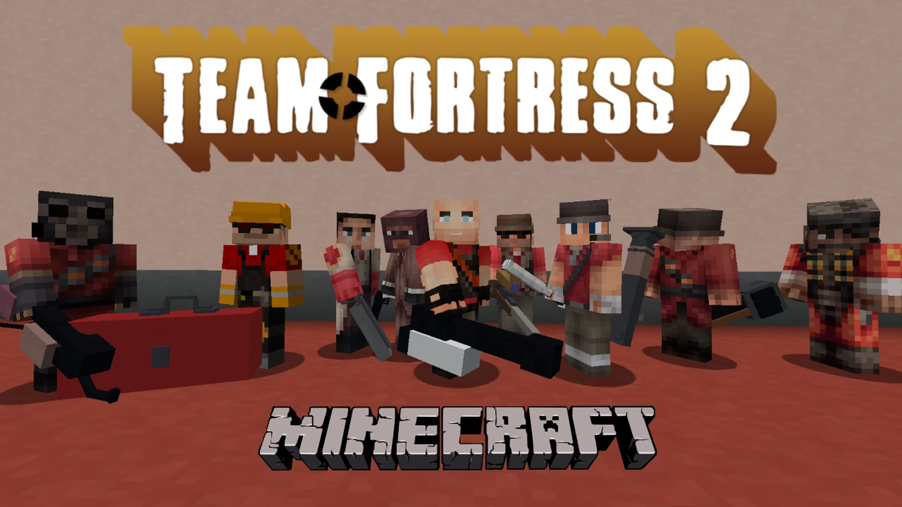

# 2Fort.CTF-团队要塞夺旗战

## 基本信息

**作者:** [Knux](https://www.planetminecraft.com/member/knux/)

**版本:** 1.17

**官方:** [PM](https://www.planetminecraft.com/project/team-fortress-2-minecraft-project/)

完整标签（点击展开）

完整中文标签: 
`团队`, `娱乐`, `Ctf`, `迷你游戏`, `Multiplayer`, `Class`, `Fortress`, `Tf2`, `Fps`, `Valve`, `Capturetheflag`, `Teamfortress2`, `2fort`, `Other`, `数据包`

原始标签（点击展开）

原始英文标签: 
`Team`, `Recreation`, `Ctf`, `Minigame`, `Multiplayer`, `Class`, `Fortress`, `Tf2`, `Fps`, `Valve`, `Capturetheflag`, `Teamfortress2`, `2fort`, `Other`, `Datapack`

图片展示（点击展开）

## 介绍

### TF2风格体验降临《我的世界》！

历经三年断断续续的开发，如今您可以在《我的世界》中体验《军团要塞2》的经典玩法！无需安装任何模组，仅需使用1.17版本（更高版本暂未测试，使用需自行承担风险），即可畅享九大职业与夺旗模式的完美复刻！

**特色系统**  

#### 🎯 职业体系  
- 完整重现**侦察兵、士兵、火焰兵、爆破手、重机枪手、工程师、医疗兵、狙击手、间谍**九大职业  
- 每名角色配备标志性武器与专属道具，技能组合还原原作精髓  

#### 🚩 竞技模式  
- 支持多人联机的**夺旗模式**，完美复刻团队对抗体验  
- 精心搭建的**ctf_2fort**地图，从零重建确保场景还原度（若仅需地图无需玩法，禁用数据包即可）  

#### 💥 战斗系统  
- 采用**射线判定**与**弹道模拟**双轨射击机制，致敬原版手感  
- 全系列武器均按《我的世界》风格重新建模，同时植入大量TF2原版音效  

---

**重要说明**  
- 🌐 当前暂未开放官方服务器，但地图已预设联机功能，可自行搭建服务器与好友畅玩  
- 🐞 本项目尚属**测试阶段**，将持续更新内容与修复问题。欢迎通过Planet Minecraft平台或Discord社群反馈建议  
- 👨‍💻 除部分TF2原始素材外，所有建模、编程、场景搭建均由开发者独立完成  

**社区参与**  
加入Discord社群获取最新动态：discord.gg/Rs7Jpq5D8j  
Curseforge项目页：https://www.curseforge.com/minecraft/worlds/team-fortress-2-minecraft-project  

> ⚠️ 温馨提示：使用非1.17版本可能导致兼容性问题，建议通过社群确认最新适配情况

原始介绍(点击展开)

After 3 years of on-and-off development, the Team Fortress 2 experience can now be played on Minecraft! With no mods required and on the 1.17 versions of Minecraft (later versions have not been tested yet, use at your own risk!), all 9 classes are fully re-created along with the Capture the Flag (CTF) gamemode for classic TF2 fun!Join the discord server for progress updates and discussion on the project: discord.gg/Rs7Jpq5D8jTF2MC on Curseforge: https://www.curseforge.com/minecraft/worlds/team-fortress-2-minecraft-project Features:-Play as all 9 classes from TF2 with all their weapons and items-Fully functional Capture The Flag gamemode for team based multiplayer-Near perfect re-creation of ctf_2fort built from the ground up (To use this as just a 2fort map without the functional gamemode, disable the datapack)-Hitscan and projectile based shooting inspired directly from the original game-Fully modeled weapons that fit the Minecraft style along with many, many sounds from TF2 Class Previews: (click through the gallery for previews on all the classes)So far there's no server but the map is automatically ready for anyone to set up a server and play with friends!(NOTE: This is technically a beta, more content, bug fixes and features will be updated as more people play and test it so please let me know on Planet Minecraft or the discord server for any suggestions or bug reports)Everything was built, modeled, coded, and created by me with the exception of some assets from Team Fortress 2

## 相关实况

暂无相关实况信息

## 游玩截图

暂无游玩截图
