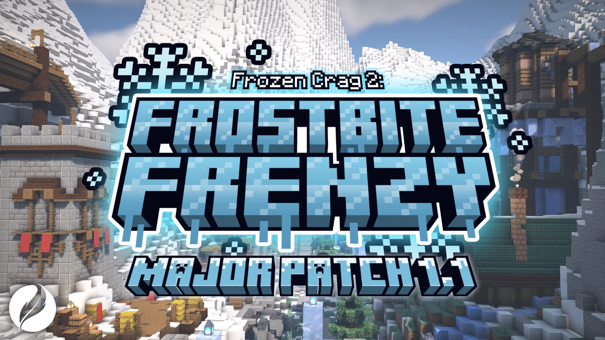

# Frostbite.Frenzy-决战冰石崖

## 基本信息

**版本：**1.21.3

**地址：**[PM](https://www.planetminecraft.com/project/frostbite-frenzy)

**作者：**[Quillmark](https://www.planetminecraft.com/member/quillmark/)

**支持人数：**无限制

完整标签（点击展开）

完整中文标签: 
`Pvp`, `迷你游戏`, `Multiplayer`, `Tag`, `Tdm`, `Sequel`, `Freeze`, `Domination`, `Teamdeathmatch`, `Controlpoints`, `Freezetag`, `Other`, `Frozencrag`, `Quillmark`

原始标签（点击展开）

原始英文标签: 
`Pvp`, `Minigame`, `Multiplayer`, `Tag`, `Tdm`, `Sequel`, `Freeze`, `Domination`, `Teamdeathmatch`, `Controlpoints`, `Freezetag`, `Other`, `Frozencrag`, `Quillmark`

图片展示（点击展开）

## **介绍：**

### ❄️ 冰冻峭崖强势回归！

经典冰冻捉人游戏模式焕新登场！本次更新带来全新地图、特色道具与多样目标，邀您体验更丰富的战术乐趣。用拳头击打敌人可将其冻结，轻拍队友即可解冻，踩踏物品箱还能获取专属强化效果！自由选择两种胜利条件与四张特色地图，开启冰封世界的精彩对决。

#### ✨ 核心特色

- **弹性人数**：支持任意数量玩家同场竞技
- **轻松上手**：简单机制让新玩家快速融入战局
- **强化系统**：16种定制强化道具助您扭转战局
- **多元地图**：四张各具特色的竞技场任君选择
  * ❄️ 冰冻峭崖：占领模式，推荐10人以上参与
  * 🌊 霜冻峡湾：团队歼灭，推荐10人以上对决
  * 🛢️ 巨型油田：占领模式，适合6-12人激战
  * 🏰 冰川堡垒：团队歼灭，容纳4-12人对抗

#### ⚙️ 自定义设置

在大厅中灵活调整以下参数：

- **胜利分数**：自定义获胜所需积分
- **冻结时长**：调整被冻结的持续时间
- **解冻速率**：设置自然解冻的速度
- **加时扣除**：配置加时阶段的分数规则
- **道具管理**：自由启用或禁用特定道具

#### 🗺️ 地图信息

- **适配版本**：1.21.5至1.21.8
- **服务端支持**：已测试Vanilla、Fabric和Paper端（Paper衍生端未经测试）
- **资源包**：已包含在地图文件中，所有玩家必须安装
- **开源资源**：数据包与资源包源码请访问GitHub页面

## **相关实况：**

- [[汉化]冰天雪地道具大战！MC多人PVP地图《决战冰石崖2：霜冻狂潮》汉化宣传片(Frozen Crag 2: Frostbite Frenzy)](https://www.bilibili.com/video/BV1EXqLYVEQ9/?spm_id_from=333.337.search-card.all.click)

## 游玩截图：
