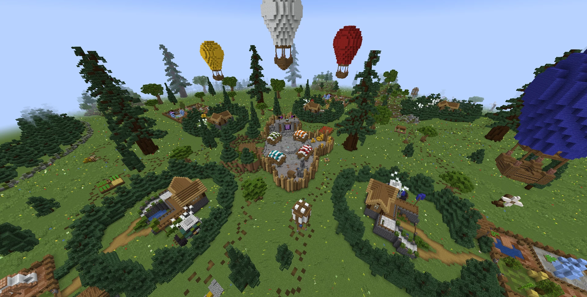
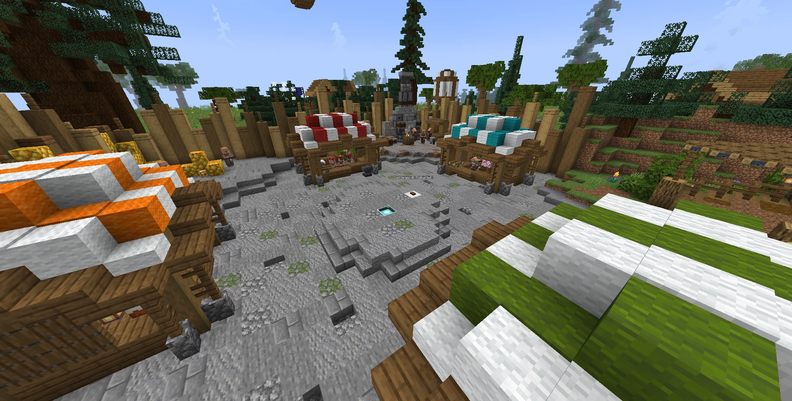

# Agrarian.Fortune-农业财富

## 基本信息

**作者:** [HugBlue](https://www.planetminecraft.com/member/hugblue/)

**版本:** 1.20.1

**官方:** [PM](https://www.planetminecraft.com/project/agrarian-fortune/)

原始标签（点击展开）

原始英文标签: 
`Challenge Adventure`

图片展示（点击展开）

## 介绍

### 农耕财富游戏模式介绍

#### 🌱 核心玩法
- 玩家通过培育不同种类的**种子**参与竞赛
- 目标是通过出售**农作物**获得最多金币
- 各种种植区域设有**解锁门禁**，需要消耗金币才能开启新区域

#### ⚙️ 特色系统
- 支持自定义**游戏参数配置**
  - 可调整**随机刻速度**优化生长节奏
  - 灵活设置**游戏时间**掌控耕作周期
- 兼具策略性与竞技性的**游戏体验**
- 当前版本：**1.20.1 + Optifine**优化版

#### 🎯 开发者寄语
作为首次发布的地图作品，我们衷心希望各位玩家能享受这片农耕天地。若在游戏中发现任何异常情况，欢迎随时反馈给我们！

#### 💙 特别鸣谢
感谢测试团队的宝贵贡献：
- Sraferr
- lulu_castor  
- Ystevak
- JustSebix
- Tsezar8376
- Nalota

---
*谨以赤诚匠心培育每一颗种子，期待与您在麦浪翻涌的田园中共谱丰收乐章* 🌾

原始介绍(点击展开)

Agrarian Fortune is a game mode in which participants compete by growing different seeds to win as many coins as possible. To earn coins, players have to sell their crops. The various cultures are blocked by gates that players must buy to continue their journey.In this game, various tools can be configured, such as RandomTickSpeed and game time.This game can become competitive with great gameplay experience.Version : 1.20.1 + OptifineThis is the first time I've posted a map, so I hope you enjoy it. Don't hesitate to send me any bugs!HugBlue ^^Thanks to the beta tester: Sraferr, lulu_castor, Ystevak, JustSebix, Tsezar8376, Nalota

## 相关实况

暂无相关实况信息

## 游玩截图

暂无游玩截图

## 游玩人次

0
