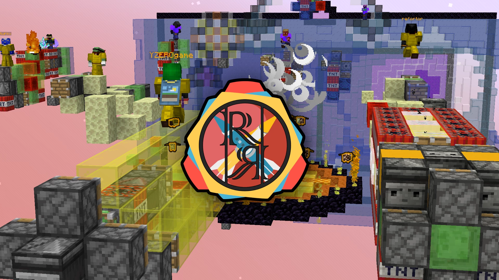

# Rocket.Riders-火箭骑士

## 基本信息

**作者:** [ZeroniaServer](https://www.planetminecraft.com/member/zeroniaserver/)

**版本:** 1.20.4

**人数：**

**官方:** [PM](https://www.planetminecraft.com/project/rocket-riders/)

原始标签（点击展开）

原始英文标签: 
`Server`, `Wars`, `Tnt`, `Multiplayer`, `Piston`, `Engine`, `Pistons`, `Explosion`, `Rocket`, `Slimeblock`, `Slime`, `Missile`, `Observer`, `Explosions`, `Slimestone`, `Honey`, `Explosives`, `Explosive`, `Rockets`, `Exploding`, `Cubehamster`, `Sethbling`, `Challenge Adventure`, `Cubekrowd`, `Multiplayermap`, `Riders`, `Flyingmachine`, `Explosiontnt`, `Stickypistons`, `Multiplayerserver`, `Datapack`, `Datapacks`, `Datapackvanilla`, `Observers`, `Honeyblock`, `Honeyblocks`, `Missilewars`, `Rocketriders`, `Zeronia`, `120map`

图片展示（点击展开）

## 介绍

---

### 🎮 游戏特色介绍

#### ✨ 核心特色

- **开发团队**：由Evtema3、YZEROgame和Chronos22历时四年精心打造
- **游戏灵感**：重新演绎SethBling与Cubehamster的经典作品《导弹战争》
- **版本支持**：当前地图版本1.2.15，兼容1.20.1-1.20.4

> ⚠️ 注意：部分特色功能（如自定义成就、1v1决斗模式等级系统）仅在自建地图中完整可用

#### 🎯 游戏内容
- **导弹系统**：20款全新社区制作导弹，涵盖不同速度与爆炸威力
- **胜利条件**：驾驭导弹穿越至敌方基地，摧毁下界传送门获取胜利
  - *特殊模式（夺旗、追击、远征）采用独立胜利判定标准*
- **道具系统**：在经典护盾与火球基础上，新增：
  - **漩涡**：悬浮天空雷
  - **华盖**：树叶平台
  - **新星火箭**：爆炸烟花弩
  - **黑曜石护盾**

#### 🎪 游戏模式
- **六大全新模式**与**十七种游戏修饰器**，持续带来新鲜游戏体验
- **大厅中央配置室**可自定义：
  - 可用道具组合
  - 基地装饰风格
  - 游戏规则设定
  - 功能参数调整

#### 🏆 成就系统
- 内含**41项定制成就**，等待玩家逐一解锁挑战

---

### 🙏 致谢寄语

本地图历经四载开发历程，衷心感谢社区成员的鼎力支持：
- 参与功能测试与漏洞反馈
- 贡献导弹设计与建设建议  
- 协助大厅建造与服务器托管
- 提供宝贵开发指导

希望各位能像我们享受制作过程一样，尽情体验《火箭骑手》带来的游戏乐趣！

—— Zeronia开发团队敬上

原始介绍(点击展开)

Installation GuideThe map currently only supports Minecraft Java Edition version 1.20.1-1.20.4. It should also be compatible with Spigot/Paper servers, although Vanilla is preferred. When you download it, you should have a zip file named "rocket-riders.zip" (or alternatively, if using the Google Drive download link, "Rocket Riders.zip".If you wish to play with your friends, you can upload this zip file directly to server hosting platforms such as Minehut, Aternos, and StickyPiston, or to your own Realm. Please refer to the instructions there for map installation.If you wish to play in singleplayer or open your world to LAN (local area network), you will want to copy this file to your world saves directory. This is located in the following places per operating system:Windows: "%APPDATA%\.minecraft\saves"macOS: "~/Library/Application Support/minecraft/saves"Linux: "~/.minecraft/saves"Then go ahead and extract the zip file directly to your saves directory. It should place the world files in a folder called "Rocket Riders". This will be how you find the world in your Minecraft worlds list.If these instructions are confusing, please refer to the Minecraft Wiki for more information.Update GuideIf you have an existing Rocket Riders world that you would like to update to the latest version while still keeping your player/world data, read below (or alternatively, watch this video!).This process involves copying over the new datapack folders from the Rocket Riders GitHub repository.You will need to go to the releases page and download the Source Code zip file for the latest release.Then drag this file to your Rocket Riders world save folder, typically located in the following places depending on your operating system:Windows: "%APPDATA%\.minecraft\saves\Rocket Riders"macOS: "~/Library/Application Support/minecraft/saves/Rocket Riders"Linux: "~/.minecraft/saves/Rocket Riders"Extract the zip file and then copy everything except "LICENSE.txt" and "README.md", as these files should not change.Navigate to your world's "datapacks" folder and delete the same folders you just copied from there before pasting the new ones in. Then delete the extracted folder and corresponding zip file now that you've pasted the new datapacks in.Finally, run "/reload" ingame to load in the new datapacks! (Alternatively, close and reopen your world.) All of your world data should be saved, and the code should be fully up to date.Note: for updating to Version 1.1.0+, you will need to run the command "/function rr_crusade:install" in chat in order to play Crusade Mode.Note: for updating to versions that are on different Minecraft versions, Minecraft should handle region file conversion automatically. If they do not, then redownload the map and copy the regions folder.🚀 ROCKET RIDERS 🚀A refreshing take on Missile Wars for modern Minecraft!Made in 4+ years by Evtema3, YZEROgame, and Chronos22Multiplayer, Minecraft Version 1.20.1-1.20.4Current Map Version: 1.2.15* Still on 1.19.4? Download Rocket Riders here!Play now on CubeKrowd: play.cubekrowd.net!** Certain features like custom achievements and ranks/XP in 1v1 Duel Mode are not currently accessible on CubeKrowd.To get access to these features, download the world for yourself!Interested in Rocket Riders? Join the Zeronia Discord Server and check out the RR Wiki!Rocket Riders is a reimagination of SethBling and Cubehamster's Missile Wars, featuring all new missiles, utility items, custom achievements, challenging gamemodes and modifiers, and tons more ways to customize your gameplay!The map includes 20 all new, community-made missiles ranging in speed and explosive power. Ride missiles across to the enemy base and explode their nether portals* to win the game!* Some gamemodes (for instance, Capture the Flag, Chase, and Crusade) have different winning criteria.In addition to the Shield and Fireball from Missile Wars, new utility items like the Vortex (floating sky-mine), Canopy (leaf platform), Nova Rocket (explosive firework crossbow), and Obsidian Shield allow for complex and unique gameplay strategies!Rocket Riders also features 6 new gamemodes and 17 game modifiers which bring new gameplay objectives and challenges to the table so the game always stays exciting!The Modification Room in the center of the Lobby allows you to select active items, base decorations, game modifiers, game rules, and more, giving you the ability to fully customize your gameplay!Rocket Riders has a set of 41 custom achievements! See if you can earn them all along the way!This map was made over the course of 4+ years.We couldn't have done it without the help of so many members of the community who tested features, reported bugs, submitted missiles, shared feedback, advised development, constructed our Lobby, hosted servers, and more over the years.Thank you, and we hope you all enjoy playing Rocket Riders as much as we've enjoyed making it!- Zeronia Development Team

## 相关实况

暂无相关实况信息

## 游玩截图

暂无游玩截图

