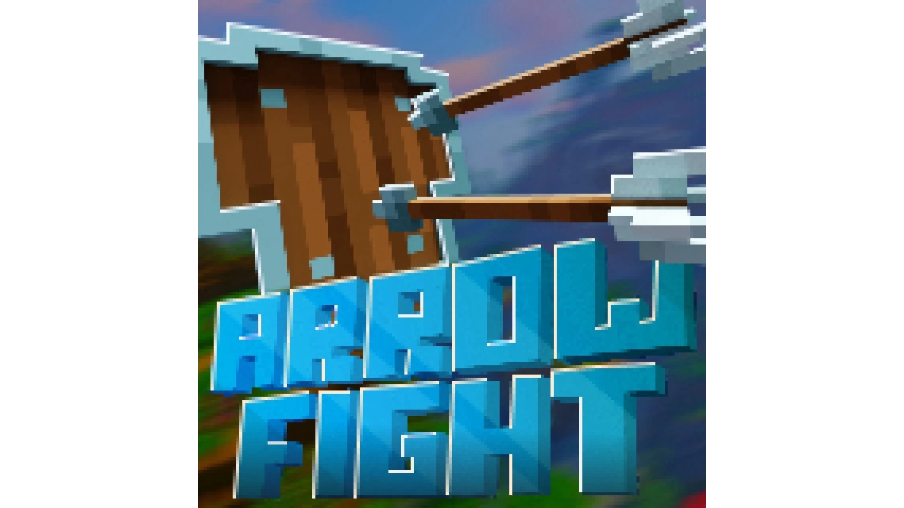
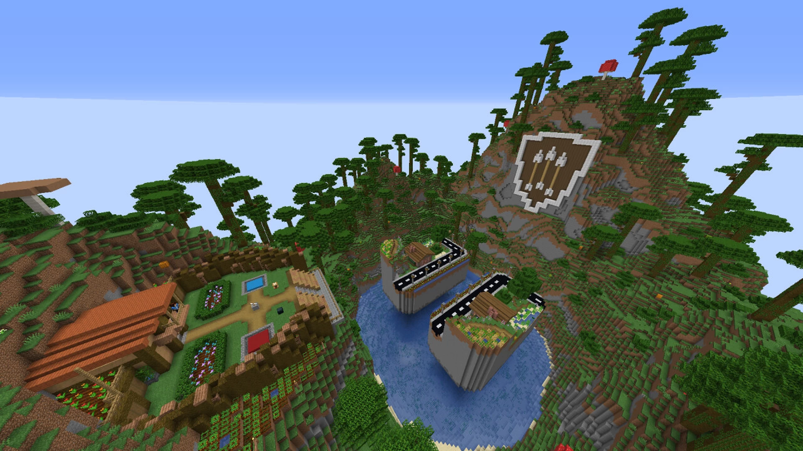

# Arrow.Fight-箭术对决

## 基本信息

**作者:** [PvPqnda](https://www.planetminecraft.com/member/pvpqnda/)

**版本:** 1.20.2

**官方:** [PM](https://www.planetminecraft.com/project/arrow-fight/)

**标签:** `PVP对战`, `其他玩法`

完整标签（点击展开）

完整中文标签: 
`Map`, `Pvp`, `迷你游戏集合`, `Arrows`, `Custom`, `有趣`, `迷你游戏`, `Multiplayer`, `Fight`, `Realms`, `Hielke`, `Challenge Adventure`, `Arrowfight`, `Other`, `Pvpqnda`, `Customarrows`, `Iwacky`, `Wackyblocks`

原始标签（点击展开）

原始英文标签: 
`Map`, `Pvp`, `Minigames`, `Arrows`, `Custom`, `Fun`, `Minigame`, `Multiplayer`, `Fight`, `Realms`, `Hielke`, `Challenge Adventure`, `Arrowfight`, `Other`, `Pvpqnda`, `Customarrows`, `Iwacky`, `Wackyblocks`

图片展示（点击展开）

## 介绍

### 箭矢对决：特殊能力箭矢大乱斗

#### 🎯 游戏概览
《箭矢对决》是一款充满策略性的多人对战小游戏，玩家将使用蕴含特殊能力的定制箭矢与敌方队伍展开激烈交锋！由 **PvPqnda** 与 **Hielke** 联袂打造，完美适配 **Minecraft 1.20.2** 版本。

#### 🏹 核心玩法
- 双方队伍将分别降临专属岛屿，快速采集资源应对即将爆发的混战
- 可制作常规装备与武器，但制胜关键在于购买拥有独特效果的魔法箭矢
- 例如：**TNT箭**落地召唤爆炸物，**火焰箭**能点燃周围方块形成火海
- 运用战术箭矢消灭对手，当敌方全员出局即获得胜利
- 特别注意：禁止在岛屿间搭建任何通行设施

#### ✨ 特色内容
- 支持 **2名以上玩家** 同场竞技
- 个性化装饰系统
- **6张风格迥异的对战地图**
- 数十种蕴含特殊能力的魔法箭矢
- 专属视觉资源包

#### 🎮 官方推荐
Mojang成员Marc评价道：*"在逆境中收集资源与谨慎探索是人类永恒的主题，双队伍/双岛屿的设定完美映照了我们内心的双重天性。"*

#### 🌐 拓展体验
- 现已在 **Minecraft Realms** 平台上线
- 访问官网 **PvPqnda.com** 获取更多地图资源
- 加入Discord社区 **discord.gg/xS57622** 获取最新动态与开发者直接交流

#### 💝 支持我们
- 通过 **patreon.com/PvPqnda** 助力开发
- 赞助者可享有：独家开发日志、更新内容优先体验、未来内容投票权等特权

#### 👥 开发团队
特别鸣谢合作开发者：
- **Hielke**：[官网] | [市场] | [PlanetMinecraft] | [Discord] | [Twitter] | [YouTube]
- **iWacky**：[Twitter]  
（记得告诉他们是我推荐的哦 😉）

---

*准备好展开这场箭雨纷飞的奇幻对决了吗？选择你的战术箭矢，成为岛屿战场的最强王者！* 🏹⚔️

原始介绍(点击展开)

Arrow Fight is a PvP minigame with custom unique arrows with special abilities that you use to shoot at the enemy team to win!Created by: PvPqnda & HielkeFor Minecraft 1.20.2Map Description:Both teams will be sent to their team's island where they will quickly gather resources to prepare for the chaos that will soon strike them.You may craft armor, weapons... ect, but you will primarily be purchasing unique arrows that each have their own special abilities.For example, the TNT Arrow spawns in 1 TNT when the arrow lands. And the Fire Arrow lights nearby blocks on fire when the arrow lands.You may use the custom arrows to eliminate the opposing team.Once all players on their team is dead, the other team wins. However, you are unable to build from island to island.• 2+ players!• Cosmetic features!• 6 unique maps to play on!• Many different arrows with special abilities!• Custom resource pack!Marc from Mojang:"Resource gathering and careful exploration in the face of adversity are a theme as old as humanity itself, and the two team/two island setup speaks to the duality within us all."Also available on Minecraft Realms!More maps on my website! PvPqnda.comJoin my Discord to know when something is released, updated, or to connect with me! discord.gg/xS57622If you'd like to further support me, my Patreon is where it's at! Also comes with exclusive posts/messages, voting power on what comes next, and access to new releases and updates as soon as they're ready! patreon.com/PvPqndaCheck out Hielke and iWacky! (tell them I sent u lol)Hielke - Website | Marketplace | PlanetMinecraft | Discord | Twitter | YouTubeiWacky - Twitter

## 相关实况

暂无相关实况信息

## 游玩截图

暂无游玩截图
