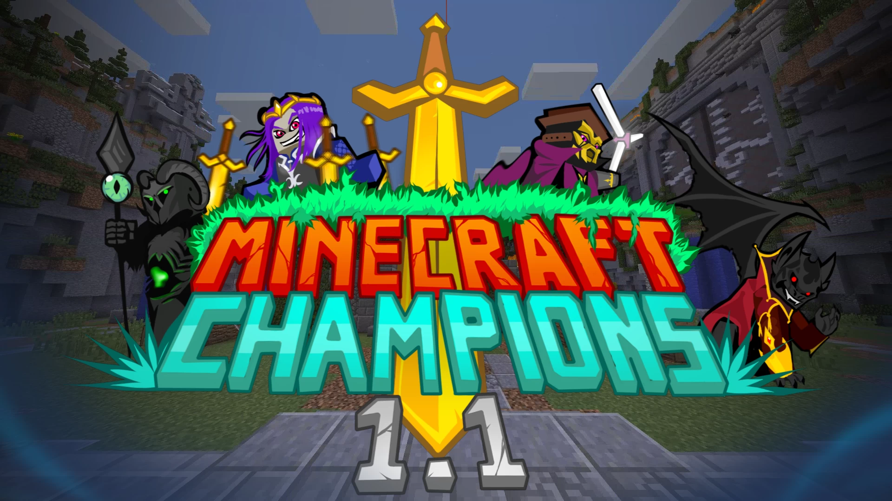

# Champions.MOBA-冠军MOBA

## 基本信息

**作者:** [luisb1202](https://www.planetminecraft.com/member/luisb1202/)

**版本:** 1.12.2

**官方:** [PM](https://www.planetminecraft.com/project/moba-minecraft-minecraft-champions-40000-commands/)

**人数:** 4-15

完整标签（点击展开）

完整中文标签: 
`复杂`, `迷你游戏`, `Multiplayer`, `Lol`, `Java`, `Moba`, `Leagueoflegends`, `Challenge Adventure`

原始标签（点击展开）

原始英文标签: 
`Complex`, `Minigame`, `Multiplayer`, `Lol`, `Java`, `Moba`, `Leagueoflegends`, `Challenge Adventure`

图片展示（点击展开）

## 介绍

### Minecraft Champions：我的世界史上最具野心的MOBA地图

#### 🎮 核心特色
- **纯原版体验** - 无需任何模组或资源包，100%兼容原版机制
- **匠心打造** - 由Iv1202与luisb1202历时四年联合开发
- **超强优化** - 通过4万行指令代码实现极致性能，彻底告别卡顿
- **多语言支持** - 完整适配英语与西班牙语本地化

#### ⚔️ 游戏系统
* **职业体系** - 15位风格各异的英雄配备专属技能组
* **战术维度** - 包含60+独特技能与终极招式组合
* **经典元素** - 防御塔、丛林野怪、数据统计、核心枢纽、装备商店
* **进阶模式** - 极速模式（URF）与训练模式满足不同需求
* **动态数据** - 实时统计图表展现对战详情

#### 🌐 运行信息
- **适用版本**：我的世界1.12.2
- **推荐配置**：2v2竞技模式（最高支持15人同场竞技）
- **教程指南**：[新手教学视频](https://www.youtube.com/watch?v=cpHmQDf8DQU&list=PLjKNPvSDwy2USrp7Vfrr5xE1MjdKabWGp&index=2&ab_channel=luisb1202luisb1202)
- **英雄全集**：[全英雄实战演示](https://www.youtube.com/playlist?list=PLjKNPvSDwy2USrp7Vfrr5xE1MjdKabWGp)

#### 💝 开发者寄语
我们倾注了无数心血进行设计、测试与打磨，期待这份凝聚热忱的作品能为您与伙伴带来难忘的冒险体验！

*—— luisb1202 敬上*

原始介绍(点击展开)

Minecraft Champions is the most ambitious MOBA map ever created in Minecraft.Its 100% vanilla, no mods or resource packs required!Created by two people, Iv1202 and luisb1202 (me) for almost 4 years of development in total.Check out this tutorial for a quick explanation of how the map works!Tutorial: https://www.youtube.com/watch?v=cpHmQDf8DQU&list=PLjKNPvSDwy2USrp7Vfrr5xE1MjdKabWGp&index=2&ab_channel=luisb1202luisb1202)All 15 Champions video guide playlist:https://www.youtube.com/playlist?list=PLjKNPvSDwy2USrp7Vfrr5xE1MjdKabWGp Minecraft Champions 1.1 has all the classic elements of a MOBA, 15 kits/champions, more than 60 unique abilities, ultimates, towers, jungle enemies, statistics, nexus, shop, statistics, graphs, custom gamemodes (URF + Practice tool) and much, much more!(It is 100% translated into English and Spanish!)The map is for version 1.12.2 and is designed to play 2v2 although it can be played up to 15 players.One of our priorities when creating the map was that the code and functions that manage were super optimized! So you will not have any performance problems because of the commands!It has more than 40,000 lines of code (commands)Iv1202 and I have put a lot of love and enthusiasm whencreating it, testing it, editing it, etc.Hope you all enjoy playing with your friends this map :)~ luisb1202

## 相关实况

暂无相关实况信息

## 游玩截图

暂无游玩截图
