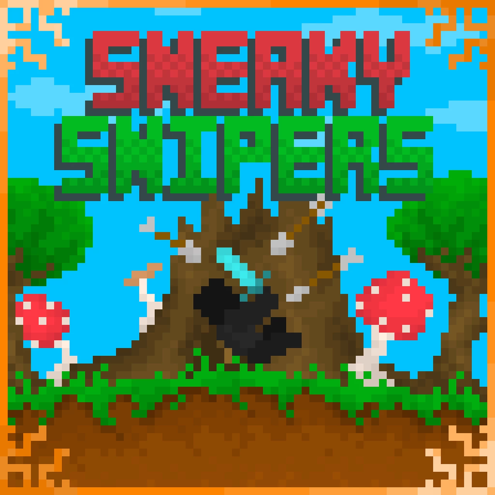

# Sneaky.Snipers.3-潜行狙击手

## 基本信息

**作者:** [ArwenOC](https://www.planetminecraft.com/member/arwenoc/)

**版本:** 1.17.0

**官方:** [PM](https://www.planetminecraft.com/project/sneaky-snipers-3/)

**标签:** `其他玩法`

完整标签（点击展开）

完整中文标签: 
`游戏`, `Map`, `Minecraft`, `有趣`, `Cool`, `迷你游戏`, `Minecraftmap`, `剑`, `Bow`, `Kits`, `Other`, `Coolgame`

原始标签（点击展开）

原始英文标签: 
`Game`, `Map`, `Minecraft`, `Fun`, `Cool`, `Minigame`, `Minecraftmap`, `Sword`, `Bow`, `Kits`, `Other`, `Coolgame`

图片展示（点击展开）

## 介绍

### 潜行狙击手3 - Aseiwen建造团队作品

> ⚠️ **重要提示**：请确保使用世界文件夹中自带的**必备资源包**

#### 🎯 游戏概览

《潜行狙击手3》是一款以**职业套装**为核心的PVP竞技游戏。玩家将手持**一击必杀之剑**与**无限耐久弓箭**，背负**鞘翅**降临战场，在七张风格迥异的地图中展开激烈角逐。通过击败其他玩家累积击杀数，率先达成目标者即可赢得胜利！

随着战绩累积，您将解锁：
- 🏹 **炫酷弓箭皮肤**（通过击杀获得）
- ⚔️ **华丽剑刃皮肤**（通过击杀获得）  
- ✨ **箭矢轨迹粒子特效**（通过胜利获得）

#### 🗺️ 战场巡礼

游戏内含八张精心设计的竞技地图：
- *经典*（复刻SS1原版地图）
- *阶梯战场*
- *四象限*（基于SS2地图重构）
- *攻城要塞*
- *蔓生丛林*
- *考古遗址*  
- *外星秘境*
- *火山炼狱*

每张地图均设有封闭式竞技边界，大厅选图后将实时加载对应战场环境。

#### 🎪 职业套装详解

八种特色职业带来截然不同的战斗体验：

**折射者**
- 每15秒获得一枚棱镜
- 手持右键发射探测光束
- 光束轨迹附近的敌人将显形

**忍者**  
- 常驻速度II与跳跃提升II效果
- 身轻如燕的突袭专家

**末影使者**
- 每15秒获得末影珍珠
- 施展空间传送的战术大师

**暗黑法师**
- 3格范围内的敌人获得失明效果
- 近身剑斗的绝佳搭档

**炼金术师**  
- 每45秒获得致命药水
- 可瞬间消灭群体敌人
- 🚨 注意：误伤自身同样致命！

**初代宗师**
- 为高手设计的挑战模式
- 禁用一击必杀剑的硬核体验
- 复刻SS1原版战斗风格

**深海狂鲨**
- 配备激流三叉戟
- 兼具瞬杀与水域推进功能
- ⚠️ 经典地图无水域慎用

**荒野大盗**
- 入场即配弹弓武器
- 每15秒自动补充石块弹药
- 命中后造成减速+禁跳+失明组合效果

#### 💫 收藏品系统

通过累计击杀与胜利场次，逐步解锁更多武器外观：
- 达成50总击杀即可解锁石弓与石剑
- 右键点击未解锁武器可查看获取条件
- 每件收藏品都记录着您的辉煌战绩

#### 👥 制作团队

**Aseiwen建造团队**倾情呈现：
- Akittylover & Minecrafter10081（场景建造）
- ArwenOC（场景建造与代码实现）

**联络我们**：
- 🎮 Discord社区：https://discord.gg/rCRYM9v  
- 🐦 推特关注：https://twitter.com/aseiwenbuild
- 🌐 官方网站：https://aseiwenbuildteam.godaddysites.com/

---

✨ *愿您在流光箭雨中书写属于自己的传奇！*

原始介绍(点击展开)

Sneaky Snipers 3 by Aseiwen Build TeamREQUIRED RESOURCE PACK IN WORLD FOLDER-- Overview --  Sneaky Snipers 3 is a kit based pvp game where the player is provided with an instant kill sword, instant kill infinity bow, and an elytra, and jumps into one of seven maps to battle other players until one reaches the required ammount of kills to win the game.You can collect cosmetic bow and sword skins by getting kills and wins, and get arrow trail particles by getting wins.-- Maps --  Sneaky Snipers 3 has 8 unique maps: Classic (Based on the SS1 map), Tiered, Quadrants (Based on the SS2 map), Siege, Overgrowth, Excavation, Extraterrestrial, and Volcanic. Each map fits inside the walls of the game arena, and new maps will be loaded at the start of a game, depending on which map is selected in lobby.-- Kits --  There are 8 kits in the game listed here:Refractor- Is given a prism every 15 seconds that can be used by right clicking while holding it. Right clicking with the prism shoots a beam, and anyone near the beam trajectory is lit up so the player can see them more easily.Ninja- Spawns into the arena with the Speed II and Jump Boost II potion effects applied at all times.Enderman- Given an ender pearl every 15 seconds that can be used to teleport placesDark Mage- Players within 3 blocks of the dark mage are given blindness. Especially useful for encounters needing the swordBrewer- Is given a deadly potion every 45 seconds, which can be used to splash a group of enemies and kill them all. Be careful though, if you splash yourself with the potion you will die.SS1 Pro- This kit is more of a challenge for experienced players, as it sets them at a disadvantage to others. In Sneaky Snipers 1, the player did not have an instant kill sword, and accordingly, players with this kit selected will be given the challenge of not using a sword in the arenaShark- The shark kit is given a Riptide I trident, which acts as an instant kill sword, and a launching tool when you are in water. The Classic arena doesn't do too well for this kit, as the Classic SS1 map didn't have water, and does not in SS3 eitherBandit- Is given a slingshot upon dropping into the arena. Every 15 seconds, a rock will appear in the inventory of players using this kit. The slingshot uses rocks as ammo, and when right clicking with the slingshot, it will use a rock, and shoot it with a curved trajectory. If the rock hits a player, it will slow them down for a few seconds and make them unable to jump, as well as blinding them, making them easier to hit, especially with a bow.-- Cosmetics --  In Sneaky Snipers 3, you gather total kills and wins. As you get more total kills and wins, you get access to more weapons, such as the stone bow and stone sword, when the player reaches 50 total kills. The ammount of kills / wins needed to get each weapon can be found by right clicking locked weapons.-- Final Note --  This map was created by Aseiwen Build Team members Akittylover and Minecrafter10081 (Builders) and ArwenOC (Builder and Coder). If you wish to communicate with us join our discord server using this link: https://discord.gg/rCRYM9vTwitter: https://twitter.com/aseiwenbuildWebsite: https://aseiwenbuildteam.godaddysites.com/

## 相关实况

暂无相关实况信息

## 游玩截图

暂无游玩截图

## 游玩人次

0
