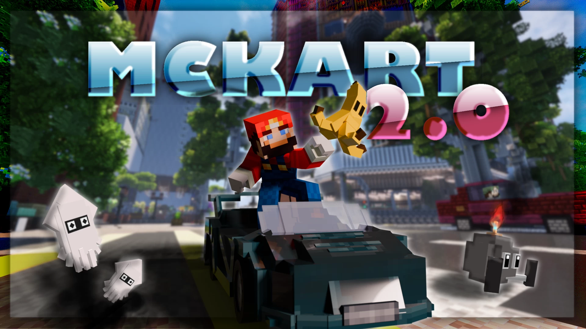

# Mario.Kart.2-马里奥赛车2

## 基本信息

**作者:** [SkyblockSquad](https://www.planetminecraft.com/member/skyblocksquad/)

**版本:** 1.20.4

**官方:** [PM](https://www.planetminecraft.com/project/mario-kart-in-minecraft-mckart-2-0-1-20-4/)

**人数:** 1-12（超过会卡）

完整标签（点击展开）

完整中文标签: 
`游戏`, `矿车`, `Sky`, `任天堂`, `Minecraft`, `Creative`, `Build`, `Server`, `Building`, `史诗级`, `Skyblock`, `Games`, `迷你游戏`, `Multiplayer`, `Creation`, `马里奥`, `New`, `Youtube`, `Cars`, `Competition`, `Singleplayer`, `Popular`, `Community`, `Latest`, `Kart`, `Racing`, `Competitive`, `Luigi`, `Trending`, `Sbs`, `Challenge Adventure`, `Mariokart`, `Driving`, `Featured`, `Top`, `Racingcar`, `Lootbox`, `Skyblocksquad`, `Trackmania`, `竞速游戏`

原始标签（点击展开）

原始英文标签: 
`Game`, `Minecart`, `Sky`, `Nintendo`, `Minecraft`, `Creative`, `Build`, `Server`, `Building`, `Epic`, `Skyblock`, `Games`, `Minigame`, `Multiplayer`, `Creation`, `Mario`, `New`, `Youtube`, `Cars`, `Competition`, `Singleplayer`, `Popular`, `Community`, `Latest`, `Kart`, `Racing`, `Competitive`, `Luigi`, `Trending`, `Sbs`, `Challenge Adventure`, `Mariokart`, `Driving`, `Featured`, `Top`, `Racingcar`, `Lootbox`, `Skyblocksquad`, `Trackmania`, `Racinggame`

图片展示（点击展开）

## 介绍

### MCKart 2.0 正式发布

历经十二个月的精心雕琢，我们自豪地推出迄今为止最宏大的创作——**MCKart 2.0**！这款在《我的世界》中打造的竞速游戏融合了《马里奥赛车》与《赛道狂飙》的经典元素，为您带来无与伦比的驾驶体验 🏁

#### 🎮 多元游戏模式
- **休闲模式**：与好友组队驰骋赛场，最多支持12人同场竞技
- **天梯模式**：挑战极限速度，争夺排行榜首位宝座
- **数据追踪**：通过官网 mckart.skyblocksquad.de 实时查看个人战绩

#### 🚗 创新驾驶系统
- **全新漂移机制**：通过精准操控获得额外速度加成
- **起步加速**：倒计时至2秒时长按W键触发强力起步
- **道具箱系统**：收集随机道具获取战术优势

#### 🎁 个性化收藏
- **战利品箱**：开启宝箱获得限定外观与装饰道具
- **海岛探索**：既可驾驶卡丁车飞驰，亦可徒步发掘隐藏秘境
- **商城系统**：使用游戏币与卡丁车碎片兑换各类皮肤及道具

#### 🏰 特色大厅功能
- **跑酷挑战**：精心设计的轻度解谜关卡，全程无存档点考验操作耐力
- **赛道投票**：玩家可投票选择下一场赛道（商店购买超级投票可影响结果）
- **多语言支持**：根据游戏语言设置自动切换德语/英语/日语/中文/俄语

#### 💫 赛事机制详解
1. 组建最多12人的比赛房间
2. 通过积分结算系统，名次将决定每场赛事获得的金币数量
3. 比赛收益可用于解锁各类收藏品与功能道具

---

### 🌐 社区互动
欢迎加入我们的社群平台，分享您的精彩创作与游戏心得 ✨  
同时订阅YouTube频道，更多精彩内容持续更新中！

#### 📱 官方链接
- **YouTube频道**：https://www.youtube.com/@skyblocksquad
- **Discord社群**（英德双语）：https://discord.com/invite/VVsargEvby
- **推特动态**：https://twitter.com/SkyblockSquad
- **Instagram**：https://www.instagram.com/skyblocksquad

原始介绍(点击展开)

MCKart 2.0 RELEASE!!!!!MCKart 2.0 is our biggest project so far. We spent 12 months creating this impressive game in Minecraft. And we are very happy how it turned out. MCKart is inspired by racing games like Mario Kart and Trackmania. You can play it with friends in the normal mode, or fight for the next record or the first place in ranked mode. If you are playing on our server you can also see your statistics on the website mckart.skyblocksquad.de. We also added a new drifting mechanic, which you can use to earn some extra speed boosts. There are a lot of cosmetics you can buy or win with the new lootboxes. You can explore the breathtaking island by foot or with your kart and maybe reveal some secrets ;). One of the Lobbys features is the parkour. The parkour is not very hard but it could definitly take you a while to complete. Watch out: it does not have any checkpoints!So how does the game actually work?Players can form a lobby with up to 11 friends (12 in Total) in order to be grouped together for the next race.They have the ability to vote for the next track to be played on. (This can also be rigged with Super Votes bought from the shop)Once the countdown ticks down, a starting boost can be obtained by already holding 'W' when the timer ticks 2.Item boxes can be collected to give players temporary advantages over their opponents (items).Your placing decides (among other factors) the coins you earn after a race.Coins and Kart Fragments can be spent in the shop for various skins, cosmetics and items!Supported Languages (Custom Texts, change automatically with minecraft language setting) :GermanEnglishJapaneseChineseRussianPlay on skyblocksquad.de (Java 1.20.4/1.21.4)You can join our Discord server and show off your cool creations and have feedback :D(Also make sure to subscribe to our YouTube Channel, we made sooo many cool things and much more is coming soon ^^)LINKS:--------------------------Social MediaCheck out our Youtube Channel!https://www.youtube.com/@skyblocksquadOur Discord (ENG & GER)https://discord.com/invite/VVsargEvbyTwitterhttps://twitter.com/SkyblockSquadInstagramhttps://www.instagram.com/skyblocksquad--------------------------

## 相关实况

    
森山大马户9K

	<VideoPlayer platform="bilibili" idOrUrl="BV1iW1mB3EML" />

## 游玩截图

2025-11-07

