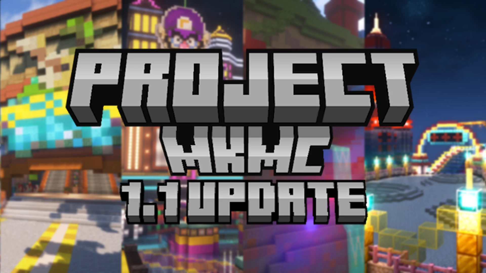

# MKMC-马里奥赛车

## 基本信息

**作者:** [MysteryHat](https://www.planetminecraft.com/member/mysteryhat/)

**版本:** 1.21.3

**官方:**  [PM](https://www.planetminecraft.com/project/project-mkmc/)

人数: 1-24

完整标签（点击展开）

完整中文标签: 
`Minecraft`, `马里奥`, `Commands`, `Items`, `Racing`, `Update`, `Nomods`, `Mariokart`, `Other`, `数据包`

原始标签（点击展开）

原始英文标签: 
`Minecraft`, `Mario`, `Commands`, `Items`, `Racing`, `Update`, `Nomods`, `Mariokart`, `Other`, `Datapack`

图片展示（点击展开）

## 介绍

### 欢迎来到MKMC：我的世界版马里奥赛车

在开始探索之前，请务必注意以下重要事项：
- **地图不支持Sodium、Optifine及其他相关模组！**
- **低配置电脑不推荐运行！**
- **无需任何模组即可畅玩！**
- 项目使用**OBJMC光影资源包**（由Godlander开发）
- **仅限我的世界Java版**使用
- 当前**仅支持1.21.3版本**

#### 🎯 项目理念
ProjectMKMC致力于在《我的世界》中完美重现《马里奥赛车》的经典体验！

#### 🏁 特色系统
- **智能竞速系统**：包含玩家速度与加速机制
- **对抗性AI**：COM/CPU对手将与你同场竞技
- **专属音乐**：精心重制的原创与经典曲目
- **丰富道具**：超过25种特色道具任你使用
- **自定义模式**：自由组合道具与规则，打造专属比赛

#### 🗺️ 赛道精选
**原创赛道（4条）**
- 专为本项目打造的独特赛道

**复古经典（14条）**
- SNES 马里奥赛道2
- N64 冰雪世界
- N64 卡利马里沙漠
- GBA 破碎码头
- GCN 路易吉赛道
- DS 碧姬花园
- DS 空中堡垒
- 3DS 害羞小子集市
- N64 大甜甜圈
- DS 暮光之屋

#### 🎮 游戏模式
- **大奖赛模式** - 经典锦标赛体验
- **对战模式** - 自由竞速比拼
- **战斗模式** - 道具攻防对抗
- **自定义模式** - 随心设定规则
- **混沌模式** - 极致混乱乐趣
- **道具雨模式** - 持续道具盛宴
- **计时赛模式** - 挑战极限速度

#### 🔔 项目追踪
关注最新动态：
**https://www.youtube.com/@mystery_hat**

🌟 准备好发动引擎，在方块世界中体验极速狂飙的乐趣吧！

原始介绍(点击展开)

Before you read all this! Map does not support Sodium, Optifine and other related mods! Not recommended on PCs with low specs!Does not require any mod! Project using OBJMC(by Godlander) shader resource packThis map only for MINECRAFT JAVA EDITION.The idea behind ProjectMKMC is to recreate Mario Kart in Minecraft! Project have:• Player speed and acceleration system;• COMs/CPUs will be againts you;• Own and recreated music;• Over 25+ items;• Custom mode(create your own race with your chosen items and rules);• 4 custom made courses and 14 retro courses (SNES Mario Circuit 2, N64 Frappe Snowland, N64 Kalimari Desert, GBA Broken Pier, GCN Luigi Circuit, DS Peach Gardens, DS Airship Fortress, 3DS Shy Guy Bazaar, N64 Big Donut and DS Twilight House)• 7 Modes to play! (Grand-Prix Mode, VS Mode, Battle Mode, Custom Mode, Chaos Mode, Item Rain Mode and Time Trial)Map supports 1-24 players(Singleplayer, Multiplayer)ONLY ON Minecraft version 1.21.3.Host a server on StickPiston!trial.stickypiston.co/map/projectmkmcHow to install map.• Extract map from zip file;• Copy map to "saves" file (C:\Users\User\AppData\Roaming\.minecraft\saves)• Open Minecraft Java Edition 1.21.3 and open map;• Enjoy the Project!Follow the project: https://www.youtube.com/@mystery_hat

## 相关实况

暂无相关实况信息

## 游玩截图

暂无游玩截图
