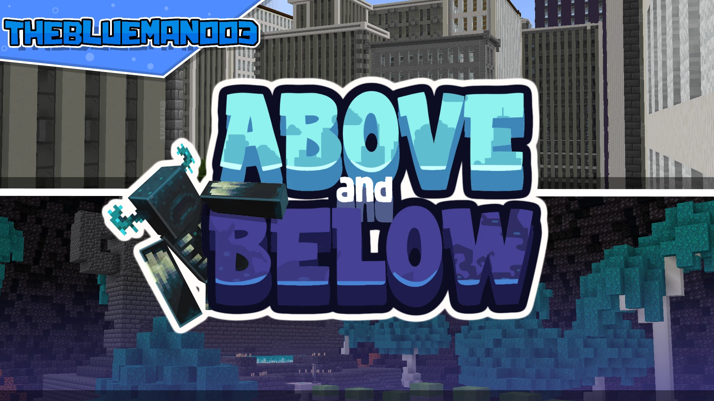

# Above.Below-天空与地底

## 基本信息

**作者:** [TheblueMan003](https://www.planetminecraft.com/member/theblueman003/)

**版本:** 1.19.3

**官方:** [PM](https://www.planetminecraft.com/project/above-amp-below/)

完整标签（点击展开）

完整中文标签: 
`跑酷挑战`, `Easy`, `Other`

原始标签（点击展开）

原始英文标签: 
`Parkour`, `Easy`, `Other`

图片展示（点击展开）

## 介绍

### 疾速跑酷：天地穿梭

在这张快节奏的跑酷地图中，您将从世界的最深处出发，通过精妙的跳跃技巧一路向上攀登，最终抵达地表之上的广阔天地。

#### 🏆 竞速排行榜
- 本地图设有**实时排行榜系统**，您完成挑战后可将通关时间上传至云端，与全球玩家一较高下
- 成功通关时，游戏内聊天栏将自动生成**专属提交链接**
- 支持**多次提交成绩**，助您不断突破自我极限

#### 📜 创作背景
本地图最初为2022年CubeDCon跑酷大赛量身打造，所有赛事期间的顶尖成绩均已完整迁移至当前排行榜系统。🎯

#### ✨ 特别鸣谢
**测试专员**  
Benjamin874 🔧

---
*纵身跃入这场垂直挑战，在方块间谱写您的空中芭蕾！* 🌟

原始介绍(点击展开)

In this fast-paced parkour map , you will have to parkour your way up from the deepest part of the world to the above.Play Above and Below on a free Minecraft Serverhttps://trial.stickypiston.co/map/aboveandbelowLeaderboardThis map has an online leaderboard where you can submit your time and compare it to the rest of the community.You'll be given a link in the chat once you completed the map.You can submit multiple time.NotesThis map was made for a parkour competition for cubedcon2022. All best times from the competition have been transferred to the my leaderboard system.Addition CreditsTesterBenjamin874

## 相关实况

暂无相关实况信息

## 游玩截图

暂无游玩截图

## 游玩人次

0
