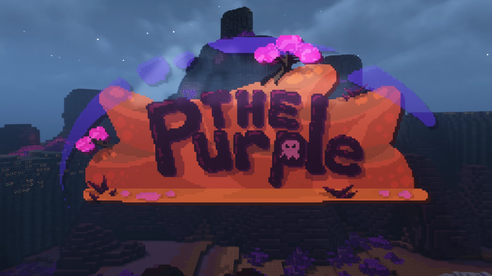
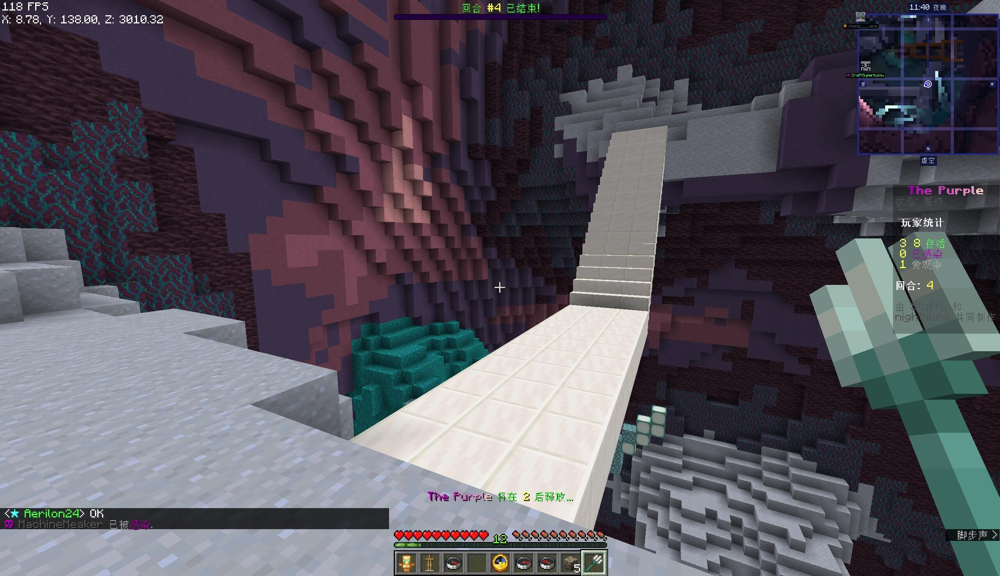
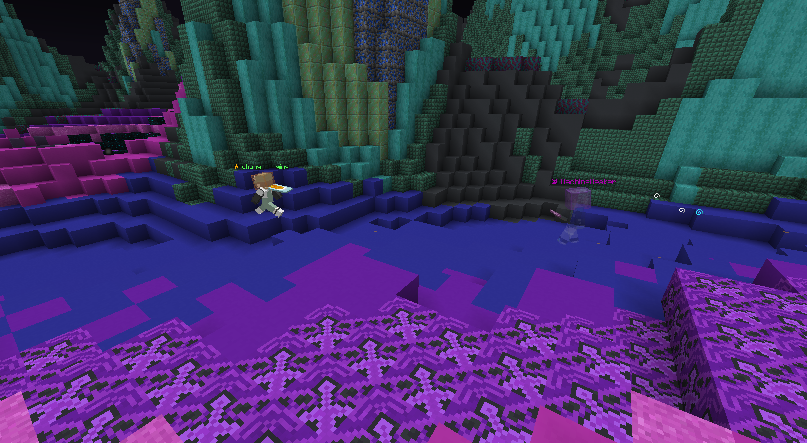
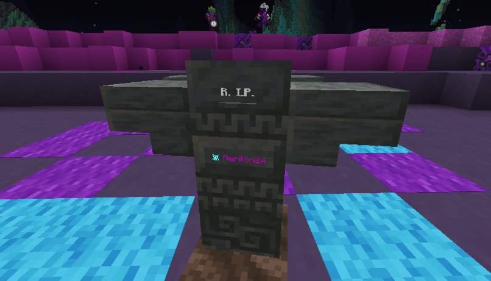

# Purple.Minecraft-紫色世界

## 基本信息

**作者:** [ZeroniaServer](https://www.planetminecraft.com/member/zeroniaserver/)

**版本:** 1.21.9

**官方:** [PM](https://www.planetminecraft.com/project/the-purple-6526015/)

**标签:** 

完整标签（点击展开）

完整中文标签: 
`迷你游戏`, `Tag`, `Minecraftmap`, `Infection`, `Purple`, `Tnttag`, `Challenge Adventure`, `Freeforall`

原始标签（点击展开）

原始英文标签: 
`Minigame`, `Tag`, `Minecraftmap`, `Infection`, `Purple`, `Tnttag`, `Challenge Adventure`, `Freeforall`

图片展示（点击展开）

## 介绍

### 🟪 紫色秘境 🟪

由 Stuffy 与 nightlibra 联合打造  
支持多人联机的 *Minecraft Java版* 游戏，当前适配版本 **1.21.9/10**  
🗺️ 地图版本：**v1.0.6**  
✨ 现已登陆 *Minecraft Realms* 平台！

---

#### 🎮 游玩须知
- 需加载**专属资源包**方可体验完整内容  
  ➠ [点击下载服务器资源包](点击这里下载服务器资源包)  
- 对《紫色秘境》或团队未来项目感兴趣？  
  🌟 欢迎加入 [Zeronia Discord 社区](加入 Zeronia Discord 服务器)！

---

#### 🌌 游戏特色
在经典**捉人游戏**基础上焕新升级！探索外星地貌，收集奇异遗物，躲避紫色感染的侵蚀——  
💫 **独创机制**：玩家永远不会真正出局！观战者既能干预战局，甚至有机会重返赛场。  
📦 多张地图、自定义设置、成就系统与隐藏要素，持续带来新鲜体验！

---

#### 🧪 道具全览

##### 生存辅助
- **不死图腾**：主手/副手持有时可抵御一次感染  
- **解毒剂**：饮用后立即清除自身感染状态  
- **缩身菇**：食用后缩小体型并提升移动速度  

##### 战术位移
- **瞬影紫颂果**：随机传送至竞技场某处，完美脱战利器  
- **末影珍珠**：投掷至安全区域实现精准转移  
- **烟雾弹**：制造浓雾遮蔽视线  

##### 攻防装备
- **三叉戟**：远程打击武器，可传递感染状态！  
- **风弹**：击退目标并转移紫色感染  
- **岩石**：投掷使玩家击退  
- **安全护甲**：格挡一次攻击后消失  

##### 战略道具
- **追踪罗盘**：定位最近玩家（最多使用4次）  
- **荧光号角**：吹响后高亮所有玩家位置  
- **囚笼钥匙**：击中目标将其暂时禁锢  
- **诱饵**：生成自身幻影混淆视线  
- **复苏灵药**：泼洒阵亡玩家使其复活！  
- **时停器**：冻结全场时间5秒  

---

#### ⚠️ 兼容性说明
以下模组/插件/服务器环境可能导致游戏异常运行，相关问题超出维护范围，为保障体验建议规避：

- **世界管理类插件**：MyWorlds、Multiverse 等  
- **版本兼容**：低于 1.21.9 的 Minecraft 服务器  

> 🎯 推荐在纯净环境中享受完整游戏乐趣！

原始介绍(点击展开)

🟪The Purple🟪Made by Stuffy and nightlibraMultiplayer, Minecraft Java Edition, Version 1.21.9/10Current Map Version: v1.0.6Now available on Minecraft Realms!A resource pack is required to play this game.Click here to download the server resource pack!Interested in The Purple or our future projects? Join the Zeronia Discord Server!The Purple is a fresh take on the classic game of tag. Explore alien landscapes, collect unique artifacts, and avoid The Purple infection! In a unique twist, players are never truly eliminated. Spectators can affect the gameplay, and sometimes even rejoin the game. With many maps, settings, advancements, and more, there is always something new to discover.Powerups:Totem of Undying: Hold this in your mainhand or offhand to survive infection!Antidote: Drink this to cure yourself!Shrink 'Shroom: Eat this to shrink yourself down and gain extra speed!Instant Chorus Fruit: Consume this to teleport away to a random destination around the arena. Great for quick escapes!Ender Pearl: Throw this to teleport away to somewhere safe. Great for quick escapes!Wind Charge: Throw this to blast players backwards. May also be used to transfer The Purple!Glow Horn: Blow this to reveal all players.Trident: Throw this to deal damage from long range. May be used to transfer infection!Prison Key: Hit someone to imprison them.Smoke Bomb: Throw this to create a cloud of smoke.Revival Elixir: Splash this on a dead player to revive them!Freeze Timer: Click this to freeze time for 5 seconds.Tracking Compass: Click this to track the nearest player. (Maximum 4 uses.)Safety Vest: Wear this to block one hit.Rock: Throw this to knock a player back.Decoy: Use this to spawn a decoy of yourself.IMPORTANT: IncompatibilitiesThis is a list of mods, plugins, and server setups where The Purple is either known or suspected to not function properly. Unfortunately, any problems that occur while using any of the following are beyond our control, and we recommend avoiding these for the most playable experience:- MyWorlds, Multiverse, and any other world management plugins- Servers running Minecraft versions prior to 1.21.9

## 相关实况

暂无相关实况信息

## 游玩截图

完全可以等价于 烫手山芋 还算不错 但有些单调

紫色世界第二乐趣是旁观者害人

