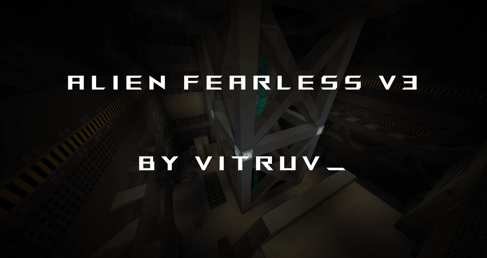
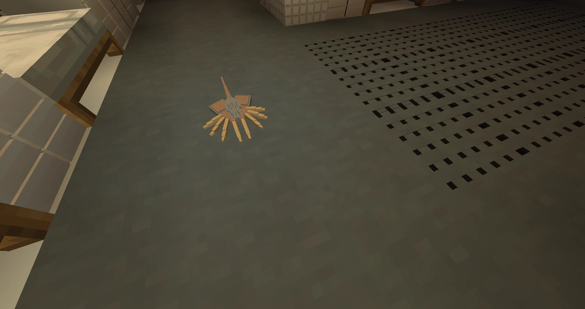

# Alien.Fearless-异形无畏.太空惊魂

## 基本信息

**作者:** [Vitruv](https://www.planetminecraft.com/member/vitruv/)

**版本:** 1.16.5

**官方:** [PM](https://www.planetminecraft.com/project/alien-fearless/)

**人数：**2-5

原始标签（点击展开）

原始英文标签: 
`Horror`, `Survival`, `Space`, `Aliens`, `Alien`, `Spacestation`, `Survive`, `Murder`, `Fear`, `Killer`, `Deadbydaylight`, `Challenge Adventure`, `Fearless`

图片展示（点击展开）

## 介绍

### 🚀 异形无畏：太空惊魂

**"在太空中，没人能听见你的尖叫"**  
⚠️ 请注意：下载需要一定时间！

---

#### 🎮 游戏简介

《异形无畏》是一款基于《异形》系列的**非对称多人恐怖地图**，支持2-5名玩家参与。一名玩家扮演**杀戮者**，其余玩家则作为**幸存者**展开生死逃亡。  
- **杀戮者目标**：阻止幸存者从**安塔瑞斯空间站**逃脱  
- **幸存者目标**：完成关键任务后乘坐逃生舱离开空间站  

---

#### 🛸 地图特色

- **场景设定**：故事发生于多层结构的**安塔瑞斯空间站**，包含多个楼层、房间与隐蔽点  
- **沉浸体验**：采用专为地图开发的**Fearless材质包V3**，所有玩家必须安装以确保完整体验  
- **核心机制**：  
  * 杀戮者可使用**通风管道系统**快速移动  
  * 幸存者可躲入储物柜规避追捕  
  * 双方均配备可升级的**专属技能**  

---

#### ⚙️ 开发历程

> 致各位玩家：  
> 很抱歉更新延迟，为确保内容完善我们进行了充分测试！  
> 当前版本为**完整发布的V3版**，已包含所有核心功能（详见更新日志）  
> 未来将推出重大更新，新增**运输系统、升降梯、零重力区域**等内容  
> 🌟 若喜欢本地图，请用钻石支持我们的努力！  

**技术说明**：  
- 本地图使用超1000个命令方块，若遇问题请通过评论区反馈  
- 为保障流畅性，**建议在服务器运行**（不支持单人模式）  
- 若准备阶段无法开始游戏，可在幸存者大厅点击**重置面板**  

> 💡 特别提醒：本地图已停止内容更新  

**重要声明**：  
🔒 请仅从本网站下载地图  
🚫 禁止重新上传地图或材质包  
⚡ 本地图资源占用较高，请确保服务器性能稳定  

---

#### 🎯 游戏指南

##### 👨‍🚀 幸存者行动纲领
- **作为幸存者，你必须完成任务才能逃离空间站。**
-  作为**幸存者** **，你**不能使用通风系统，但可以躲在储物柜里躲避杀手。
- 作为幸存者，**你还可以使用技能来提高生存几率**。
-  作为**幸存者，**你可以完成一些次要**任务**和**目标**来获得更多分数**。**
-  时间对你不利，如果时间耗尽，剩余的**幸存者都会** **死亡，杀手获胜。**

##### 👾 杀戮者作战策略
- **你作为** **杀手** **扮演异形/外星人，必须猎杀所有** **幸存者**。
- **你作为** **杀手** **可以使用通风系统，前往空间站的不同位置。**
- **作为** **杀手，** **你还可以使用各种技能来提升你追捕** **幸存者的**能力。
- **阻止** **幸存者** **逃脱，如果他们逃脱，你将输掉这局。**
- **时间对你有利，如果时间耗尽，剩余的** **幸存者** **将死亡，你将赢得这局。**
- **你不会死亡，只会减速或暂时眩晕。**

---

#### 🎮 任务系统

**交互方式**：站立于对应颜色标记点即可触发  

| 标记颜色 | 功能说明 |
|----------|----------|
| 🟢 **绿色** | 主线任务（分长/短任务） 需完成指定数量（5/7, 8/10, 13/15） |
| 🟠 **橙色** | 可解锁项目（如逃生门） |
| 🔵 **蓝色** | 次要目标/系统交互 部分需通过游戏内聊天框点击触发 |

---

#### ⚡ 核心机制详解

##### 🌀 通风系统
- 仅杀戮者可见红色标记  
- 通过聊天框选择目标通风口  
- 若交互失效，后退5格再重试可重置系统  

##### 🌟 技能系统
- 通过游戏积分解锁与升级  
- 分为5个等级（部分技能最高3级）  
- 双方阵营技能分类：  
  * 幸存者：生存/支援  
  * 杀戮者：追猎/支援  
- 同时仅可装备每个类别1个技能  

##### 🏥 复活站
- 幸存者可用收集物品兑换复活次数  
- 通过聊天框/鼠标右键交互  

##### 📡 定位系统
- 周期性向杀戮者提示幸存者位置  
- 信号强度受玩家数量与威胁等级影响  

---

#### ❓ 常见问题排解

**🔸 游戏卡顿优化**  
- 建议服务器配置：内存≥8GB，渲染距离10区块  
- 单人模式必然卡顿，仅建议用于地图预览  
- 预览时关闭平滑光照，调低渲染距离与粒子效果  

**🔸 游戏无法启动**  
- 确认所有3个准备指示灯亮起  
- 前往幸存者大厅的**游戏设置面板**点击重置  

**🔸 门体异常**  
- 门卡住时通常仍可正常使用  
- 每轮结束后会自动重置状态  

**🔸 幸存者击杀技巧**  
- 普通状态下2-3次攻击即可淘汰  
- 注意对方可能携带生命强化技能  

**🔸 卡在大厅解决方案**  
- 点击离开大厅面板  
- 紧急情况下主枢纽设有重置标识  

---

#### 👥 制作团队致谢

🎉 特别感谢测试组成员：  
- _freakymc_（封闭测试）  
- TheTrikon（封闭测试）  
- EiTiRu（封闭测试）  

---
*在幽暗的太空深处，生存之战即将打响……* 🌌

原始介绍(点击展开)

A L I ≡ N⠀⠀F ≡ A R L ≡ S S⠀⠀V 3 - IN SPACE NO ONE CAN HEAR YOU SCREAM -Be aware that the download will take some time!Check out the new project:ALIEN FEARLESS REMASTERED- THE GAME -ALIEN FEARLESS is a asymmetrical multi player horror map, based on the Alien franchise. The map can be played with a minimum of 2 and a maximum of 5 players. One player will take the role of the killer while the others play as survivors. The goal of the killer is to prevent the survivors from escaping from the (Antares) space station. The goal of the survivors is to try to escape while they have to complete tasks to escape with one of the escape pods. - THE MAP -The game takes place on a space station (Antares). On the Antares, players can try to escape the killer over several floors, rooms and hiding places. Atmosphere is created with the specially developed texture pack for the map. It is important that this is installed when playing the map for all participants!- DEVELOPMENT -Hello, I am really sorry for the late update but it was important that everything went as planed!This map is now in full release VERSION 3 and has all important features implemented (check update log).There will still be a major update in the near future that implements the transit system,lift, zero G zone and more perks. I hope you enjoy the map if so be sure to leave a diamondfor my hard work. There are way over 1000 commandblocks, so if something goes wrongdon't be annoyed and just inform me in the comment section! Notice that this map is supposed to beplayed on a server (no singel player) to prevent lag. Thanks again to my map testers!If after cklicking on READY the game does not start you can press the RESET panel in the Survivor lobby under lobby settings!I am sorry to say that the map is being discontinued!Vitruv_[ GAME INFORMATION CHART ] PLAYERS2 - 5GAME TYPEMULTIPLAYER GAME SERVER REQUIREMENTSERVER ONLY MODSVANILLA MINECRAFT / NO MODS BUILDVitruv_ TEXTUREPACKFEARLESS TEXTUREPACK V3MAP VERSIONVERSION 3MINECRAFT VERSION1.16.5 EDITIONMINECRAFT JAVA© IMPORTANT ©ONLY DOWNLOAD MAP FROM THIS WEBSITEDO NOT REUPLOAD THIS MAP OR TEXTUREPACKTHIS MAP IS RESOURCE HEAVY, MAKE SURE TO PLAY ON A STABLE SERVER- EXTRA TEXTUREPACK DOWNLOAD -Download the texturepack if you want to play the map on a server / with friends.Texturepack V3https://www.mediafire.com/file/2nl806n7blq94uz/Alien_Fearless_V3_Texturepack.zip/fileHOW TO PLAY AS: SURVIVORWhat to do as the SURVIVOR? Here are the things you can do:→ You as SURVIVOR must do TASK's to then escape the space station.→ As SURVIVOR you can not use the vent system but can hide in lockers from the KILLER.→ As a SURVIVOR you also have perks you can use to improve your odds.→ As a SURVIVOR there are secondary TASK's and OBJECTIVE's you can do to gether more points.→ Time works against you, if the time runs out the remaining SURVIVOR's die and the KILLER wins.HOW TO PLAY AS: KILLERWhat to do as the KILLER? Here are the things you can do:→ You as KILLER are the Xenomorph / Alien and must hunt down all the SURVIVOR's.→ You as KILLER can use the vent system and vent to diffrent locations on the station.→ As the KILLER you also have perks you can use to improve your hunt for the SURVIVOR's.→ Prevent the SURVIVOR's from escaping, if they do escape you loose the round.→ Time is on your side, if the time runs out the remaining SURVIVOR's die and you win the round.→ You can not die only be slowed down or temporarily be stunned. TASK's AND OBJECTIVESGENERAL: All TASK's and OBJECTIVE's are marked with a marker of a specific color, to interact with them stand on the marker!GREEN: A green marker stands for the normal TASK. There are 2 diffrent types of TASK's defined in 'long' and 'short' TASK's. You can select how many TASK's will spawn ( 7 / 10 / 15 ) and you must complete at least ( 5 from 7 / 8 from 10 / 13 from 15 ). A green progressbar will indicate your progress of the TASK.ORANGE: The orange marker indicates that something can be unlocked, for example the escapedoors.BLUE: A blue marker indicates a secondary OBJECTIVE or interaction with a system. Notice that there is not alway a progressbar and sometimes you must interact with the OBJECTIVE or system in the ingame chat via mouse left click.EXAMPLE PROGRESSBAR: ▉▉▉▉▉▉▉▉▉▉ →  ▉▉▉▉▉▉▉▉▉▉ →  ▉▉▉▉▉▉▉▉▉▉GAME MECHANICSVENTS: Vents are marked red, these markes can only be seen by the KILLER. Vent's are used by the KILLER to move fast between places.PERKS: Perks can be use by the KILLER and SURVIVOR's. You must unlock them with points you collected while playing. The perks can be upgarded. There are 5 TIERS for perks but some are maxed out early (for example some perks maximum level is TIER 3). There are 2 diffrent types of perks for both teams, (SURVIVOR's - Categorys: Survive / Support) and (KILLER - Categorys: Hunt / Support), so you can only have 1 perk of each category active at the same time. Some perks are universal and will effect other players. Equipped peks are shown in your inventory.RESPAWNSTATION: Respawnstations can be used by the SURVIVOR's. You can 'buy' yourself a respawn with collected items. Interact with the respawnstation by useing the chat / mouse + right click.PING: The ping system is a sytsem that supports the KILLER in finding SURVIVOR's. The system will periodiclly ping SURVIVORS's for the KILLER. The pings are white in color and the intesity of the pings depends on the player number and the 'meanacelevel' the SURVIVOR's have.QUESTIONS AND PROBLEM FIXESHow to reduce lag?One common problem is that the map lags a lot. This should not be the case on a suitable server. If the map still lags on the server, it is recommended to increase the memory and the computing power of the server and to set the render distance of the server to 10 chunks. On single player the map will lag and it is not recommended to play test the map on single player. But just in case turn down smooth lighting, chunks, graphics and particles to a minimum (only for viewing the map). Also you should go in spectator and overfly the map to render it (sometimes helps reduce lag and restore fps)The game does not start?To start a game all the 3 indicators in the lobby have to be on READY, this assumes that the Survivor and the Killer have pressed ready. If the game does not start even with three indicators set to READY, go to the panel GAME SETTINGS in the survivor lobby (opposite of the perk selection) and click on RESET, this should solve the problem.Vents do not work?Vents can only be used by the KILLER / ALIEN . Stand on the red marker to get the vent map (will be displayed in the chat), then use your mouse and left click on the vent you want to vent to. If you stand on a red marker and nothing happens, just move back aprox. 5 blocks and than back (this in theory should reset the vent map).Doors bugged or broken?Sometimes doors get stuck in the OPEN or CLOSED status. The doors will automaticly reset after the round has ended. Also in most cases you can still use the doors, only the door modell its self is stuck.How to kill survivors as killer?Just hit them with your fist (you have a strength effect). Survivors, if they do not have a perk or item equipped, that influences their health, will die after 2 - 3 hits.Stuck in survivor lobby?Click on the LEAVE LOBBY panel, if that does not work try spamming it or rejoin the map. In case of an emergency there should be a RESET sign in the main hub (if a slot is stuck)supervised_user_circle [ CREDITS ] supervised_user_circleThanks to _freakymc_ for map testing ( Closed Beta )Thanks to TheTrikon for map testing ( Closed Beta )Thanks to EiTiRu for map testing ( Closed Beta )

## 相关实况

暂无相关实况信息

## 游玩截图

暂无游玩截图
