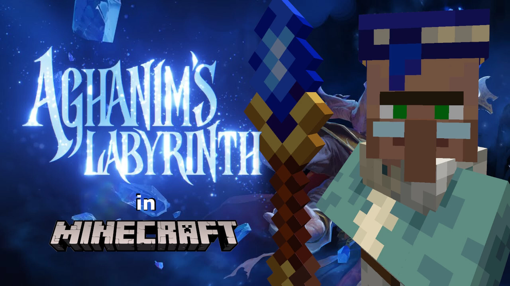

# Aghanim.Labyrinth-阿哈利姆的迷宫

## 基本信息

**作者:** [Mr_Kheese](https://www.planetminecraft.com/member/mr_kheese/)

**版本:** 1.19.4

**官方:** [PM](https://www.planetminecraft.com/project/aghanim-s-labyrinth/)

原始标签（点击展开）

原始英文标签: 
`Pve`, `Multiplayer`, `Coop`, `Custommap`, `Cooperative`, `Bossfight`, `Roguelike`, `Mobarena`, `Voiceacting`, `Dota`, `Challenge Adventure`, `Dota2`, `Custommobs`, `Customitems`

图片展示（点击展开）

## 介绍

### 阿哈利姆迷宫

#### 🎮 地图简介

- 原为《Dota 2》中的自定义模式，现由**超过5000个命令方块**历时两年精心复刻于《我的世界》
- 这是一款**Roguelike地牢竞技地图**，玩家需突破18层充满独特战斗机制与谜题陷阱的关卡
- 融合**自定义生物与物品系统**、**程序化生成房间**及**多难度解锁机制**，带来无限重玩价值

#### ⚔️ 核心特色
- **多层挑战**：18层随机生成的战斗回廊，每层蕴含独特机关与首领战
- **动态进化**：  
  *  procedurally generated room choices 程序化房间选择  
  *  unlockable difficulty levels 可解锁难度阶梯
- **协作冒险**：支持单人探索，更推荐与好友组队共闯迷宫（联机体验更佳！）

#### 🎭 致谢名单
- 感谢参与测试的全体玩家伙伴
- 致敬Valve Software原创《Dota 2》阿哈利姆迷宫模式
- 特别鸣谢Rich Sommer为阿哈利姆注入灵魂的传奇配音

#### 🔧 运行环境
- 适用版本：**我的世界Java版 1.19至1.19.4**

#### 💝 支持创作者
若喜爱本作品，欢迎通过[Ko-fi助力计划](https://ko-fi.com/mrkheese)给予支持  
每一份鼓励都将化作更多精彩地图的创作动力！✨

> 🗝️ **终极挑战**：你能否突破重重试炼，抵达迷宫尽头？

原始介绍(点击展开)

Originally a custom mode in Dota 2, Aghanim's Labyrinth faithfully recreated in Minecraft.Agh's Lab is a roguelike mob arena map. Progress through 18 floors of unique combat, puzzling traps, and in-depth boss fights. Featuring tons of custom mob and item mechanics, as well as procedurally generated room choices and unlockable difficulty levels for increased replayability.Can you make it to the end of the labyrinth? Playable in singleplayer and multiplayer, (friends recommended.)Made by me over the last 2 years, with more than 5000 command blocks.Special thanks to all my friends who helped playtest the map, Valve Software for creating the original Aghanim's Labyrinth game mode in Dota 2, and Rich Sommer's incredible voice acting talent as Aghanim.Playable in Minecraft Java Edition 1.19 to 1.19.4If you like my maps, please considering supporting me: https://ko-fi.com/mrkheeseEven a little support helps me spend more time making maps for you to play!

## 相关实况

暂无相关实况信息

## 游玩截图

暂无游玩截图
