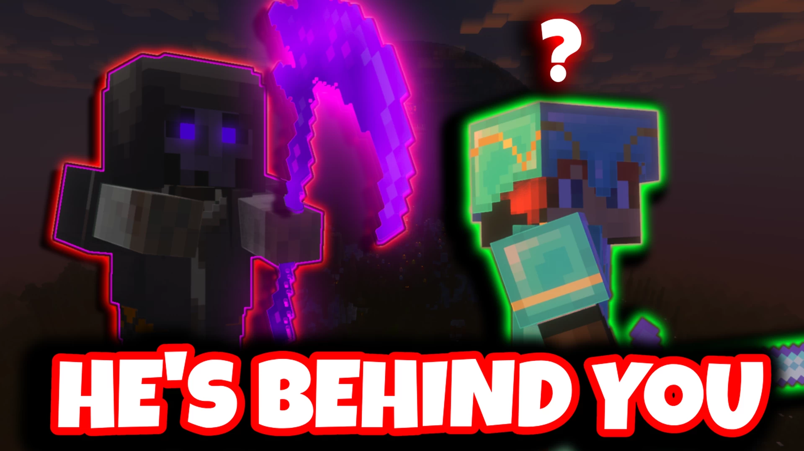

# Hardest.Zombies.Minigame-最难原版僵尸迷你游戏

## 基本信息

**作者:** [NickedZ](https://www.planetminecraft.com/member/nickedz/)

**版本:** Unknown

**官方:** [PM](https://www.planetminecraft.com/project/hardest-vanilla-minecraft-zombies-minigame-wip/)

**标签:** `其他玩法`, `PVE战斗`

完整标签（点击展开）

完整中文标签: 
`僵尸群`, `生存模式`, `Challenge`, `原版`, `迷你游戏`, `Pve`, `Multiplayer`, `Boss`, `Arcade`, `Singleplayer`, `Commandblocks`, `自定义地图`, `BOSS战斗`, `Custommobs`, `Progression`, `Other`, `数据包`, `Customgamemode`, `自定义游戏玩法`, `Roundbased`, `Customgame`, `可升级`

原始标签（点击展开）

原始英文标签: 
`Zombies`, `Survival`, `Challenge`, `Vanilla`, `Minigame`, `Pve`, `Multiplayer`, `Boss`, `Arcade`, `Singleplayer`, `Commandblocks`, `Custommap`, `Bossfight`, `Custommobs`, `Progression`, `Other`, `Datapack`, `Customgamemode`, `Customgameplay`, `Roundbased`, `Customgame`, `Upgradable`

图片展示（点击展开）

## 介绍

### 地图介绍
这里展示的一切都是我在单人模式下亲手打造的。没有使用任何模组或插件，仅通过**12000多个命令方块**转换而成的自定义数据包。这是一款极具挑战性的回合制街机生存模式，旨在将原版《我的世界》的潜力推向极致。

📺 **高清完整演示视频**：https://www.youtube.com/watch?v=Zq9dRWNZ3Jg

#### 🎮 核心特色
- **职业系统**：5种可完全升级的玩家职业，每种都拥有独特战斗风格
- **怪物图鉴**：50+种具备特殊能力的自定义生物
- **战场地图**：8张充满环境危险的沉浸式场景
- **连招系统**：技能组合可触发连锁质变效果
- **经济体系**：以墨西哥卷饼为载体的永久成长经济系统
- **隐藏内容**：更多尚未展示的惊喜机制等待发掘...

#### ⚙️ 开发进度
本项目仍处于持续优化阶段！目前正在：
- 精细调整终局玩法平衡性
- 设计新增首领战斗机制
- 完善地图细节与视觉效果

#### 🗓 未来规划
- 扩展终局挑战内容
- 优化首领战设计（包含死神重制）
- 最终视觉特效与音效打磨
- 新增两张战略地图与场景交互元素
- 全面地图视觉革新

#### 💬 参与共创
诚挚邀请您提出宝贵建议！欢迎在评论区分享对正式版的期待。最终可下载版本将在完成后同步发布于Planet Minecraft平台。

> 📝 特别声明：演示视频中出现的两张地图模板及部分物品贴图非原创内容，正式版本将获得授权使用或进行完整替换。

原始介绍(点击展开)

Description:Everything you see here was built by me in singleplayer. No mods, no plugins, just 12,000+ command blocks converted into a custom datapack. This is a brutally hard, round-based arcade survival mode designed to push vanilla Minecraft to its absolute limits.YOUTUBE LINK FOR FULL QUALITY VIDEO: https://www.youtube.com/watch?v=Zq9dRWNZ3Jg&ampCurrent Features:🎯 5 fully upgradeable player classes with unique playstyles👹 50+ custom mobs with special abilities🗺 8 immersive maps packed with environmental hazards⚡ Skill combos that chain together for massive effects💰 Permanent burrito economy for long-term progression🔥 And so much more I haven’t had time to show yet…Development Status:This is still a work in progress! I’m polishing late-game balance, adding new boss mechanics, and finishing map details before release.What’s Next:Additional endgame contentBoss fight tweaks (including the Reaper)Final visual polish and audio effectsTwo new maps, map polish/visual overhalul to mapsReactive map elementsGet Involved:I’d love your feedback! comment what you’d like to see in the finished version. The final downloadable map will be available here on Planet Minecraft once complete.Disclaimer:Two maps shown in my showcase video and a few item sprites were not created by me. In the final version, these will either be used with permission or replaced entirely.

## 相关实况

暂无相关实况信息

## 游玩截图

暂无游玩截图

## 游玩人次

0
