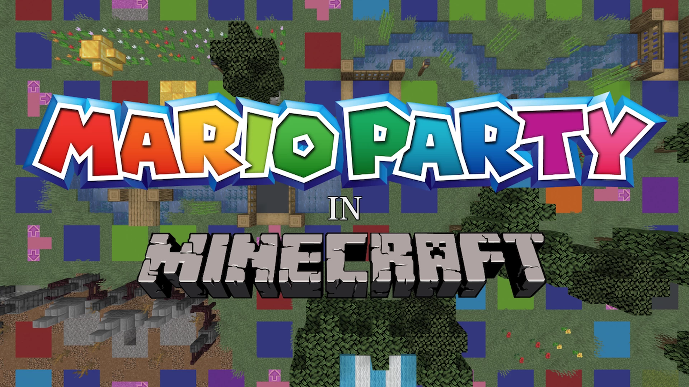

# Mario.Party-马里奥派对

## 基本信息

**作者:** [Mr_Kheese](https://www.planetminecraft.com/member/mr_kheese/)

**版本:** 1.20.1

**官方:** [PM](https://www.planetminecraft.com/project/mario-party-board-game-and-minigame-map/)

完整标签（点击展开）

完整中文标签: 
`迷你游戏集合`, `Party`, `迷你游戏`, `Multiplayer`, `马里奥`, `自定义地图`, `棋盘游戏`, `Marioparty`, `Other`, `派对游戏`

原始标签（点击展开）

原始英文标签: 
`Minigames`, `Party`, `Minigame`, `Multiplayer`, `Mario`, `Custommap`, `Boardgame`, `Marioparty`, `Other`, `Partygame`

图片展示（点击展开）

## 介绍

欢迎来到这款灵感源自经典《马里奥派对》的多人竞技地图！专为2-4名玩家设计，融合策略博弈与趣味挑战，带您体验像素世界的狂欢盛宴。

#### 🎮 核心玩法
- **回合制竞技**：玩家轮流在地图移动，通过掷骰决定前进格数
- **资源收集**：沿途收集**金币**，用于兑换特殊道具与**星星**
- **迷你游戏**：每回合结束触发全员参与的趣味竞技，优胜者获得额外金币奖励
- **胜利条件**：游戏结束时持有最多星星的玩家荣登冠军宝座

#### ✨ 特色内容
*   **六张全新地图**：每张地图拥有独特主题机关与隐藏路线
*   **超60款迷你游戏**：包含原创玩法与经典模式复刻
*   **精密指令系统**：依托7000+个**命令方块**构建稳定游戏框架

#### ⚙️ 服务器配置须知
请确保服务器设置符合以下要求：
- `enable-command-block=true`
- `spawn-animals=true`
- `spawn-npcs=true` 
- `spawn-monsters=true`
- `view-distance=10`（建议≥10以获取最佳视野）

> 💡 当前仅支持《我的世界》Java版1.20.1运行环境

#### 🙏 致谢声明
特别鸣谢所有参与测试的玩家与[Ko-Fi平台](https://ko-fi.com/mrkheese)的支持者。若您喜爱本作品，可通过赞助助力创作者投入更多开发时间。同时向任天堂公司致敬，感谢其开创性的《马里奥派对》系列游戏。

---
🎊 准备好与好友共赴这场充满惊喜的冒险之旅了吗？

原始介绍(点击展开)

This multiplayer map for 2 to 4 players is heavily inspired by the classic Mario Party games. Take turns moving around the board to collect coins and trade coins for items and stars. At the end of each turn all players compete in a minigame for extra coins. Most stars at the end of the game wins.Featuring:  -6 brand new boards.  -Over 60 new and classic minigames.  -Made with more than 7000 command blocks.Special thanks to everyone who helped test the map and to everyone who donated to me on Ko-Fi.If you enjoy my maps, help me spend more time making them by supporting me:ko-fi.com/mrkheeseAlso thanks to Nintendo for publishing the original Mario Party games. Please do not sue me.-=-=-=-=-=-=-=-=-=-=-=-=-=-=-=-=-=-IMPORTANT SERVER SETTINGS:enable-command-block=truespawn-animals=truespawn-npcs=truespawn-monsters=trueview-distance=10       (or more than 10)The map is currently only playable on Minecraft Java 1.20.1

## **相关实况：**

[[联壁计划] 原版风小游戏合集地图Mario Party马里奥派对官方宣传片](https://www.bilibili.com/video/BV15G411d7M5)

## 游玩截图

暂无游玩截图
