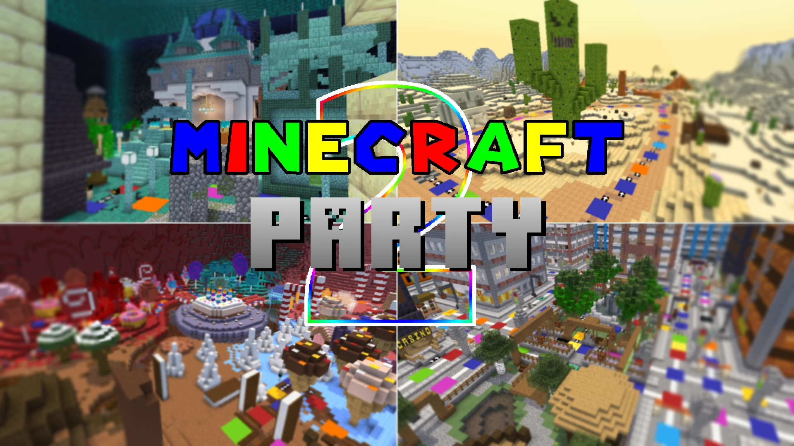

# Minecraft.Party.2-Minecraft派对.2

## 基本信息

**作者:** [TeamMCP](https://www.planetminecraft.com/member/teammcp/)

**版本:** 1.21.7

**官方:** [PM](https://www.planetminecraft.com/project/minecraft-party-2-6030280/)

**人数:** 2-10

完整标签（点击展开）

完整标签: 
`复杂`, `Minecraft`, `太空`, `Battle`, `Park`, `Port`, `迷你游戏集合`, `跑酷挑战`, `Party`, `迷你游戏`, `Multiplayer`, `马里奥`, `Coins`, `Dice`, `Christmas`, `Items`, `2v2`, `Strategy`, `Sequel`, `4players`, `Candyland`, `Board`, `Duel`, `Challenge Adventure`, `Spaces`, `棋盘游戏`, `1v3`, `Stickypiston`, `Floatingislands`, `Spots`, `Porttown`, `Strategygame`, `Lostcity`, `Clashassassin`, `Grandprix`, `派对游戏`, `4人地图`, `Loominardy`, `Uel`, `Centerpark`

原始标签（点击展开）

原始英文标签: 
`Complex`, `Minecraft`, `Space`, `Battle`, `Park`, `Port`, `Minigames`, `Parkour`, `Party`, `Minigame`, `Multiplayer`, `Mario`, `Coins`, `Dice`, `Christmas`, `Items`, `2v2`, `Strategy`, `Sequel`, `4players`, `Candyland`, `Board`, `Duel`, `Challenge Adventure`, `Spaces`, `Boardgame`, `1v3`, `Stickypiston`, `Floatingislands`, `Spots`, `Porttown`, `Strategygame`, `Lostcity`, `Clashassassin`, `Grandprix`, `Partygame`, `4playermap`, `Loominardy`, `Uel`, `Centerpark`

图片展示（点击展开）

## 介绍

### 我的世界派对2：终极多人游戏体验

欢迎来到《我的世界派对2》！这是一款专为2-10名玩家设计的多人派对游戏，灵感源自经典的马里奥派对系列。游戏包含丰富的内容和多样的玩法，让你与好友享受无尽的欢乐时光！

#### 🎯 游戏特色总览

- **多元迷你游戏**：超过100款精心设计的迷你游戏，涵盖多种类型：
  - 34款自由混战游戏
  - 14款2v2团队对抗
  - 14款1v3不对称对战
  - 9款战斗类游戏
  - 7款金币收集游戏
  - 14款决斗游戏
  - 8款微型决斗游戏

- **丰富游戏元素**：
  - 30+种实用道具
  - 15张风格迥异的游戏棋盘
  - 标准游戏时长约2小时（含40个玩家回合+1小时迷你游戏）

- **灵活玩家配置**：
  - 支持2-10名玩家（建议偶数玩家，非强制）
  - 允许旁观者加入

#### 🎮 核心玩法

**主要目标**：在游戏结束时获得最多的**星星**。若星星数量相同，则通过**金币**数量决定排名。

**核心机制**：

- 玩家通过掷骰子（1-10点）移动，每个格子会触发不同效果
- 经过**星星商人**时可用金币购买星星，每次购买后商人会随机移动
- 格子效果包括：获得/失去金币、触发随机事件、决斗、战斗迷你游戏等
- 道具只能在掷骰子前使用，可帮助自己或阻碍对手
- 除购买星星外，还可通过赢得最多迷你游戏、触发最多事件等方式获得**奖励星星**

**回合流程**：

- 所有玩家完成回合后，将随机进行迷你游戏
- 迷你游戏中的表现决定金币奖励

#### 🎪 游戏模式

##### 快速游戏模式

- 自由体验所有迷你游戏
- 不记录分数，可随时切换模式
- 支持自定义或随机分配队伍

##### 回合模式

- 固定回合数（根据设置调整）
- 最后回合结束时颁发奖励星星
- 最后五回合触发特殊事件

##### 星星竞速模式

- 率先获得指定数量星星的玩家获胜
- 包含实时更新的奖励星星
- 当有玩家获得75%所需星星时触发特殊事件

##### 大奖赛模式

- 连续进行迷你游戏
- 按固定顺序循环5种游戏类型
- 仅通过金币数量决定胜负
- 游戏结束时颁发随机奖励

##### 双人模式

- 4名玩家分成2队进行游戏
- 队友共享金币和星星
- 支持星星竞速或回合模式

##### 超级派对模式

- 最多支持10名玩家
- 可组队或单人游戏
- 重新调整金币分配机制

##### 迷你派对模式

- 专为2-3名玩家设计
- 禁用1v3游戏

#### 🗺️ 特色棋盘介绍

##### 中心公园

- 城市主题棋盘，玩家靠右行驶
- 交叉路口出口状态会变化
- 包含两个星星商人和**票券星星**奖励

##### 空中群岛

- 任务导向型棋盘
- 包含传送器和玩家位置扰乱机制
- 奖励给完成最多圈数的玩家

##### 港口小镇

- 经典2x2格子设计
- 特色Bew船只可偷取金币或星星
- **盗贼星星**奖励给偷取最多金币的玩家

##### 失落之城

- 静态星星商人，最多同时出售3颗星星
- 6回合昼夜循环，星星价格浮动
- 包含钥匙商店、守卫Boss战等特殊事件

##### 糖果乐园

- 线性路径设计，两条主路通往星星商人
- **购物星星**奖励给在商店消费最多的玩家

##### 吃豆迷宫

- 最大棋盘，近200个格子
- 包含能量豆和传送机制
- **豆子星星**奖励给收集最多豆子的玩家

##### 禅意花园

- 日式主题，内外双环设计
- 可一次性购买最多5颗星星（价格递增）
- 包含三叉戟计时赛等挑战

##### 蘑菇洞窟

- 洞穴主题，包含祭坛系统
- 投入金币获得随机道具
- 奖励给祭坛投入最多金币的玩家

##### 管道峡谷

- 传送主题，包含多种传送方式
- 3对付费传送器和2对自动传送点
- **传送之星**奖励给使用传送最多的玩家

##### 节奏房间

- 音乐主题，星星价格动态变化
- 多种特殊格子效果
- **幸运星星**奖励给触发最多特殊格子的玩家

##### 郊区争夺

- 投资地块获得星星的独特机制
- 包含第五个隐藏地块
- **多样化星星**奖励策略性投资玩家

##### 高空盛宴

- 运送食物给巨人的特色玩法
- 食物可能被其他玩家抢夺
- 奖励给发起最多对决的玩家

##### 神秘环礁

- 魔法主题，包含15种咒语
- 使用幻影快速穿越岛屿
- **施法者星星**奖励给施放最多咒语的玩家

##### 礼物宫殿

- 圣诞主题，收集和运送礼物
- 包含幸运路径和三个挑战
- **圣诞助手星星**奖励给运送最多礼物的玩家

##### 尘沙荒漠

- 昼夜交替，星星商人变为破坏者
- 包含金字塔传送和随机生成神庙
- 奖励给完成最多神庙阶段的玩家

#### 🎲 迷你游戏精选

**自由混战类**：

- **坠落者**：从世界高度极限穿过随机生成的环圈下落
- **怪物射击**：射击天空落下的不同分值怪物
- **洞穴跑酷**：在废弃洞穴中穿越15个检查点

**团队对抗类**：

- **木筏竞速**：在冰水赛道完成2-3圈
- **监狱伙伴**：合作完成5阶段解谜
- **坦克大战**：乘坐船只用弓箭攻击对手

**特殊机制类**：

- **记忆长廊**：记忆并重现15个方块的画布
- **按钮搜索**：隐藏并寻找对方按钮
- **龙之末日**：在天空岛屿躲避龙的破坏

#### ⚡ 特殊事件

每局游戏触发一次特殊事件，由最后一名玩家从7个随机事件中选择2个：

- 五个随机格子变为机会时间
- 星星仅售1金币
- 召唤五个星星商人
- 双倍金币奖励/损失
- 大骰子模式
- 格子颜色交换
- 所有道具增强

在回合模式的最后五回合或星星竞速模式有玩家获得80%所需星星时触发。

#### 🔧 设置与操作指南

**基本要求**：

- Minecraft版本1.21.7/1.21.8
- 至少8区块渲染距离
- 稳定的服务器连接
- 至少一名操作员玩家

**重要提示**：

- 禁止使用Lunar客户端
- 禁止使用Paper服务器
- 只能在玩家回合开始时暂停游戏

**操作员命令**：

- 设置金币：`/scoreboard players set 玩家名 Coins X`
- 设置星星：`/scoreboard players set 玩家名 boardstars X`
- 强制开始迷你游戏：`/function mcp:start_minigame`

#### 🌍 多语言支持

目前支持语言：

- 英语（默认）
- 海盗语
- 俄语
- 中文

#### 🤝 加入社区

想要找到玩伴？欢迎加入我们的Discord服务器！

- 与全球玩家组队游戏
- 直接向开发者反馈建议
- 每周进行地图测试
- 新玩家享有测试优先权

---

*准备好与好友一起体验这场史诗级的派对冒险了吗？《我的世界派对2》等你来探索！* 🎉

原始介绍(点击展开)

ASSET PACK FOR CONTENT CREATORSMCP2 Resource Pack (Separate)Current build: 2.0MINECRAFT PARTY 2 IS NOT COMPATIBLE WITH PAPER SERVER OR LUNAR CLIENTPlease let us know if you're looking for a group to play with!Play Minecraft Party 2 on a Free Server with StickyPiston MapsMinecraft Party 2 is a 2-10 player game loosely based on Mario Party. This game features 100 minigames which include:34 Free-For-All Minigames14 2v2s14 1v3s9 Battle Minigames7 Coin Minigames14 Duel Minigames8 Micro Duel MinigamesMinecraft Party 2 also includes 30+ different usable items and 15 unique boards to play on.Estimated Standard Gameplay Time: 2 hours (Can vary depending on settings chosen. Expect around 40 individual player turns + minigames to take around 1 hour)Number of Players: 2-10 (even number recommended but not required) (spectators allowed)Basic GameplayThe main objective for players is to earn the greatest number of stars at the end of the game. Players who are tied in Stars will have their placements determined by Coins. Stars can be bought using coins whenever the player passes the star seller. With each star purchase, the star seller moves to another random location on the board. From each player’s turn, they have the opportunity to move and earn coins. Players can take their turn by rolling (dropping) the dice and move that corresponding number of spaces. The dice rolls a random number 1-10. Each spot has a different effect on the game. Such spots can include receiving 3 coins, losing 3 coins, triggering a random coin event, triggering a duel, triggering a battle minigame, random fortunate event, random unfortunate event, a board/spot specific event, receiving a movement or trap item, or activating chance time. Coins can be used to buy stars or items from a shop. You can buy an item by walking past it and selecting the item you want to buy. Items can only be used prior to a roll. These items can be used to help you obtain stars or stop others from obtaining them. In addition to buying a star from the board, players can earn bonus stars by winning the most minigames, triggering the most events, moving the most spaces, or holding the most coins at one time. After all players have taken their turn, a random minigame will occur allowing each player to earn coins by placing in the minigame.GamemodesCurrently, there are four gamemodes that players can play in.Quick Play ModeThis gamemode allows for players to freely play any of the minigames. No scores are kept in this gamemode, and it can be ended at any time by starting a game in another gamemode. For duels and team-based minigames, players have the option to set the teams and players up as they wish or randomize the roles.Turn ModeThis gamemode is strictly a specific number of turns (depending on settings). Bonus stars get awarded at the end of the last turn. Multiple players can tie for any of the bonus stars. Both bonus stars and board stars are included when determining placement. A special event occurs at the beginning of the last five turns.Star Race ModeThe first player to obtain a specific number of stars (depending on settings) wins the game and the placements are determined at that point. This gamemode includes live updated bonus stars. No two players can hold the same bonus star at the same time. Players can earn bonus stars as the game goes on and lose them to other players as well. Bonus stars and board stars are both included when determining placement. A special event occurs after a minigame once the first player obtains 75% of the number of stars required to win.Grand Prix ModeThis gamemode is back-to-back minigames. You win coins for placing in minigames based on the default coin distribution. The minigames played include a diverse selection of minigame types. The minigames come in cycles of 5 in this order: 4 For all, 2v2, 1v3, Duel, and then finally a modified Free for all minigame. Duel minigames have a 60% chance for a regular duel and a 40% chance for a Micro duel (best of three). Modified Free for all minigames change the coin distribution and allow for coin minigames and battle minigames to be played. The teams are set up so that each setup for 1v3s, 2v2s, and duels will occur at least once with 4 players. For 6, 8, and 10 players, the team assignments may be random or go through a cycle. There are no stars nor board play in this gamemode. Earn the most coins to win! At the end of the game, random bonuses will be awarded to players.Doubles ModeThis gamemode will allow four players to compete in two teams of two. Coins and stars are shared amongst teammates. 1v3 minigames are disabled and 2v2 minigames always occur with the same team combination. This gamemode can be played in either Star Race mode or Turn Mode.Mega PartyThis gamemode allows up to 10 players to play at once! Can be played in either Turn Mode or Star Race Mode. Can be played as two large teams or in solo mode or in pairs (with exactly 8 players). Coin distribution is reweighted. 2v2 Minigames become two teams against each other. Certain 1v3 Minigames become 2v6s if played with 8 players. This gamemode is recommended for an even number of players, but not required.Mini PartyThis gamemode allows for smaller parties of 2-3 players! Can be played in either Turn Mode or Star Race Mode. 1v3 minigames disabled.BoardsCenter ParkCenter park is a board that takes place in a city surrounding an urban park. In this city, players travel on the right side of the road. When entering an intersection, there are always two exits available. Right away, the East and West exits at every intersection are open. When a player lands on a magenta spot these exits close and the North and South exits open. The exit states swap every time a player lands on a magenta spot or uses a traffic whistle. This board includes two star sellers because of the high number of spaces. The custom bonus star is the “Ticket Star”. You can buy tickets from the Ticket Masters at the casinos on the corners of the map. At the end of the game, one random player's ticket is drawn and that player receives the Ticket Star.Airborne IslesAirborne Isles is a board that revolves around quests. Players can go on quests and collect items for rewards. The custom bonus star for this board goes to the first player to complete the most laps around the board. This board also includes teleporters which players can use for a fee to move around the board. Magenta spots will trigger a player spot scramble. There is lots of strategy in this board when it comes to moving around and at the same time, despite the board appearing large, it is quite traversable. Overall, this is a more advanced board that has original concepts not found in traditional Mario Party boards.Port TownA more classic-style Mario Party board that uses 2x2 spaces instead of 3x3. The general movement is in a clockwise square. There are three shops on the board each with 8 item slots. This board’s main feature is Bew’s ship which is a way to steal coins from opponent’s when passed or steal a star at a cost of 40 coins. Magenta spots can teleport you to a random spot or make you take a tumble or disable the ship for two turns. The custom bonus star, the “Coin Thief Star”, is awarded to the player that steals the most coins throughout the game. This includes stealing through Bew, coin thief, or coin snatcher. Overall, this board is more beginner friendly and similar to what you’d expect in Mario Party.Lost CityIn this board the star seller is static and offers up to 3 stars at a time. There is a 6 turn day and night cycle. During the day, the stars cost 20 coins. During the night, the star cost can vary from 5, 10, 15, 30, or 40 coins. The board is designed such that item spaces and board events are mostly on the outside whereas the star seller is in the middle. This board also has three passable board events: The Key Shop, guardian boss fight, and Hardini's star duplication trick. Magenta spaces open or close gates when landed on. The custom bonus star goes to the player who used the most items. Overall, this board is meant to be better for shorter games compared to other boards as players can earn lots of stars in a short amount of time. However, this board can be exciting in long games too!CandylandCandyland puts players in a world full of treats where they need to make it to the star seller at the end of the path. The star seller remains in one spot for the whole game. This board has two main paths that lead to the star seller at the end. One is a shorter path. The other is a longer path that includes two board events. The board events include memorizing a path and finding a spot in a gingerbread basement. The bonus star for this board is the shopping star which is awarded to the player that spends the most coins on items in shops. This is fairly simple, straightforward linear board.Pac-MazeThe largest board of them all! This massive board includes nearly 200 spaces and pellets scattered about. The warps on the sides of the board can be used to traverse around easier. Additionally there are power pellets that enable players to steal coins and send their opponents back to the start if passed on the board. This board includes two star sellers and a few blocked off paths that can be opened. The custom bonus star is the Pellet Star which is awarded to the player that collects the most pellets throughout the game. Pellets do not respawn. Overall, this board has plenty of options for travel which gives opportunity for various strategies.Zen GardenThis board resembles a Japanese theme with various decor around the board. The shape of the board is a small circle inside of a larger circle with paths that connect each other. At each intersection, the player must move right or left and cannot go straight. You can buy up to five stars at a time on this board, but with each additional star costing more. Because of the difficulty of reaching the star seller, the board bonus star is given to whoever gets the most star transactions. There is always a trade-off for buying more stars with each interaction with the star seller. This board also includes shops and free item pickups on the outside with a small inside circle that can be used to make your way around the map. In addition, this board includes a trident time trial, a music disc challenge, and a mastermind challenge all of which award coins. And finally, this board includes a chaotic magenta space that can shuffle around players' coins or stars. There's a good amount of strategy on this board and always somewhere exciting to travel to.Mooshroom GrottoThis board is a vast cave with some interesting secrets going on. The board is shaped with a larger outer circle with elevators around. Featuring three board challenges including brewing a potion, killing spiders, and mining for ores in a dark cave, you'll always find yourself collecting coins for the altars. In the middle of this board, there are four different altars you can visit. The altars allow you to dump in coins and receive random items as a reward at a lower expected cost than the shop. You can increase your sacrificial power by collecting an enchantment shard from a brown mushroom hut and dropping it into the altar. The bonus star for this board gets awarded to whoever throws in the most coins into the altars. And finally, this board has an option to visit Bew where you can steal coins or a star from an opponent.Pipe CanyonWarps! Warps! Warps! This board involves various teleporting across the map. Inspired by classic Mario Party, this board has a combination of Mario Party and Minecraft themed builds. There are three challenges where you can earn coins from including a color warp maze, defusing a cannon, and painting a canvas with boots. Around the board there are 3 pairs of warps that you can use for a fee to teleport across the map. In addition to this, there are two additional magenta warp pairs that are used automatically when landing on the space. On top of this, Bew is included in the center of the board. The custom bonus star is awarded to whoever uses the most warps. This includes warp tolls and magenta spaces but not the green pipe in the middle of the map. Overall, in this board it's slightly easier to obtain stars compared to other boards due to the warping options and the overall layout.Rhythmic RoomThis music-themed board looks simple at first, but has it's share of surprises. The star price on this board starts at 20 coins and can change to 0, 5, 10, 15, 20, 30, or 40 coins when a player lands on a metronome space. This board has the largest variety of magenta spaces among all the boards. Magenta spaces do the following: Piano- Gives or takes 5 coins from all playersDrum- Launches player to a random spaceChair- Launches player to a random playerHorn- Launches player to star spaceMetronome- Changes star price In addition to the crazy magenta spaces, there are two board challenges; one that tests your mashing, and another that tests your pitch. The bonus star for this board is the luck star and is awarded to whoever lands on the most yellow, black, and chance time spaces.Suburbia ScrambleThis board works differently than other boards. To obtain stars, you must invest your coins into plots. If you have the most coins invested in a plot, you are the owner of that plot and can get up to 3 stars depending on how many coins are invested in that plot. The star rewards are as follows per plot (4 Players):1-34 coins: 1 star35-69 coins: 2 stars70+ coins: 3 starsIn addition to this, there is a fifth plot in an area away from the main board. This plot always awards the owner 3 stars. However, this plot is rather hard to get to. You can get on the path by entering the manhole on the board. The manhole can be opened from the magenta space immediately before it or by using ghost/ghoul mode to get through. This board also features a picnic challenge and Pablo The Pincher who reinvests coins from opponents' plots into yours. The bonus star for this board is the Diversification Star and is awarded to whoever's smallest plot investment is the greatest. Overall, the plot mechanic is different from the other boards and can be chaotic with lots of room for strategy.Lofty LuncheonRoam around on a table with feasting Giants. On this board, Giants will request food items. Deliver the food item being requested and you will be rewarded with a star. First you must make it to the food item and pick it up, then you must make it back to the giant that made the request. Be careful, after you grab the food item, players can pass you and steal it for themselves. In addition to the food, there are two small challenges that can be played to earn coins; the water bucket clutch challenge and the sesame seed bun challenge. The bonus star for this board is awarded to the player that initiates the most duels, micro duels, and battle minigames. Lofty Luncheon is a small board including a unique food gimmick and well suitable for beginners.Arcane AtollThis magical island includes various different secrets. Visit the Arcane Wizard's hut to cast a spell of your choice or cast a random spell by landing on a magenta space. In total, there are 15 spells that can be cast which add chaos to the game. This board also include an archeology challenge, a bog monster fighting challenge, and a dripleaf parkour which you can attempt to earn coins. Additionally, you can use the phantom to travel across islands faster for a small cost. The board bonus star is the Spell Caster Star and is awarded to whoever casts the most spells.Present PalaceGet into the Christmas spirit with this board. Collect presents around the board or by beating challenges and deliver them to Santa's elves for coins. Stars are 30 coins on this board. If you're lucky, you can make it to the lucky path and get a free star. Magenta spaces will spawn presents around the board for you to pick up. There are three challenges on this board: The Ice Plunge, Grinch's Cave, and The Snow Pit challenge. Beat these challenges to earn presents or coins. Whoever delivers the most presents will win the Santa's Helper Star. Overall, this board is a fun Christmas themed board that is easy to traverse.Dusty DunesMake your way through the hot and dusty desert. This board has two phases; day time and night time. During the day, the Star Seller at the end of the board sells you a star for 20 coins. During the night, the star seller gets replaced with a Ztar Seller who will destroy one of your stars if you approach him. Each time someone approaches the Star/Ztar Seller, the board switches from day to night or vice versa. Magenta spaces can either switch the board phase or launch you back to the start. This board also features the Sandy Cannon which can be used to launch yourself closer to the end of the board. Additionally, this board has pyramid warps and randomly generated temples you can pass that include 3 challenges from a bank of 11 total challenges! Complete all three stages in a temple, and win 15 coins! The bonus star is awarded to whoever completes the most temple stages.MinigamesHere is a list and brief description of each minigame. (Green=Free for all, Blue=2v2, Orange=1v3, Gray=Battle minigame, Yellow=Coin Minigame, Dark Red=Duel, Red=Micro Duel)Dropper: Fall down through randomly generated rings from the world height limit to the bottom of the world.Monster Shoot: Shoot monsters falling from the sky. Each monster is worth different points.Cave Parkour: Parkour through 15 checkpoints in an abandoned cave with a randomly chosen path.Raft Racers: Complete two or three laps through an ice and water course on a raft. Six different paths possible.Knockout: Punch players out of the map with a knockback stick.Sky Fly: Using an elytra, fly as far as you can through randomly generated rings.Spleef: Dig ground and shoot blocks beneath other players to get them to fall off.Meat Slap: Tag! Stay tagged for the least amount of total time possible.Gladiators: All players fight to the death to be the last one standing.Tedious tasks: Complete your 8 tasks before the other players do. You can also grief others to slow them down.Tile Capture: Capture the most land possible by cutting players off. The tile color changes beneath you.Rainbow Run: Agility test. Collide with moving blocks and earn more points the higher up the rainbow you collide with them.Platforms: Choose one of three platforms to jump on to score points but get nothing if another player chooses the same platform as you.Runner: The ground disappears as you run over it. Stay in the game the longest.Horse Race: Race using horses. Complete checkpoints and avoid the lava and fire.Speed Builders: Copy 4 randomly chosen designs the fastest.Steve Says: Parody of Simon Says. Do what Steve tells you to do or get eliminated.Power Towers: Spam mash to build the highest possible tower in 10 seconds.Red Light, Green Light: Move during green light. Stop during red light or get set back to the start.Farming Frenzy: Harvest the most crops in a given time period and be on the lookout for seasonal crops.Port Priority: Scavenge for three items across the map in order.Match Me Not: Select a unique item from the other players to advance yourself.Rocket Launch: Fly the farthest distance with an elytra and a single rocket.Memory Lane: Memorize a canvas of 15 blocks and place the blocks in the correct spot as the original.Pearl Hurl: Race through an ender pearl obstacle course in The End.Take Flight: Elytra rocket racing.Whack-A-Mob: Just like whack-a-mole but with Minecraft monsters.One Shot Wonder: You get one arrow that instantly kills. Rack up the most kills to win.Odd One Out: One villager looks different. Find it quickly.Sheep Scramble: Guess the number of sheep in a herd.Trident Tumblers: Riptide trident jumping.Puzzled: Recreate a 3x4 puzzle by swapping and rotating piecesBoss Battle: All players fight the same boss at once. Deal as much damage as possible to the boss.Minecraft Party Intelligence Quiz: Answer multiple choice questions testing your recall of the current state of the game.Prison Pals: Complete five stages of cooperative puzzles faster than the other team.Rock, Paper, Scissors, Chase: Choose rock, paper, or scissors against your opponents, and be prepared to chase or run.Tanks: Team brawl where you ride a boat and shoot arrows at opponentsCapture The Flag: PvP game where you must bring the opponent’s flag to your side first.Mine Your Business: Search for your opponents in a small box of stone and kill them.Team Hockey: Work with your teammate to score two goals while dealing with multiple turtles (pucks).Maze Navigator: You and your teammate must find an orb in the randomly generated maze and then meet together.Bombs Away!: Throw TNT at your opponents’ island and knock them off.Labyrinth: Top player guides bottom player through randomly generated maze by rotating sections while bottom player must collect two pieces of gold.Snow Wars: A snowball fight but the snowballs hurt a bit more.Space Jumpers: One player shoots arrows to bring out blocks on a wall for the other player to jump on. The jumper must make it to the end of the wall to win for their team.Boom Carts: Redirect explosive minecarts towards your opponents but avoid being hit yourself.What The Cluck?: Shoot eggs that can bank shot at your opponents on a 2D playing field while avoiding their shots.Recruitment Royale: Knock monsters into holes to join your team's army then use them to fight against the other team's army.Hide and Seek: 1 player hides from 3 seekers.Game Theory: Choose one of three options against another player with a payoff matrix to determine total rewards.Gold Rush: Collect gold coming from multiple conveyor belts. Team of three collects “scrappy seconds”.Boss Brawl: One player plays as the Electro-Skeleton boss and tries to fend off attackers.Block Buster: Team of three disguise as blocks and try to hide from the seeker.Pac Cube: Pac Man in Minecraft! But with a few twists.Ghost Hunt: Invisible Ghosts try to haunt the villagers while the ghost hunter defends the village.Treetop Hop: Player on the trees shoots from a crossbow against three players on ground with normal bows.Slime Time: Slime team tries to catch the runner before the time ends.In The Zone: Each team tries to capture the zone by standing in it and knocking each other away.Eggcellence: Each team tries to match two walls full of eggs the fastest.Mouse Trap: Team of 3 throw eggs that set blocks on the ground and attempt to trap the 1 in a 1x1 space.Ravager Rodeo: Solo player rides on ravager and charges at opponents.Ghast Blast: One player vs. three ghasts that try to shoot each other down.Minions: Guide your minion horde towards the other player’s horde and eat their army.Turtle Hockey: Punch a turtle into another player’s goal.Fight Fight Fight!: 1v1 Fight using swords and bows.Ring In The Ring: Tug-of-War bell ringing.Don’t Push My Buttons: Press buttons against your opponent to change the wall color to your color.Go Fish!: Catch a fish first.Bridge Crossing: Enter your opponent’s hole on their sky island while defending your island.Pig Pushers: Push your pig to the barn first.Balance Beam: Move across the skinny beam without falling off.Button Search: Hide a button from your opponent, then search for your opponent’s button that they hid from you.Betris: Tetris, but in Minecraft.Deuce: Beach Volleyball minigame where you keep playing until someone is ahead by two points.Decryption: Translate a message with letters into a numerical code quickly.Cannoneers: Carefully aim a shot at your opponent's cannon over a wall with wind.Color Chaos: Step on the correct color before the rest of the floor disappears.Color Trails: Create a trail behind you and avoid stepping on other players’ trails.Musical Minecarts: Get in a minecart fast once the music stops.Hole In The Wall: Walls with holes come at you from four directions and you must fit yourself inside the holes to avoid getting pushed off.Dragon Doom: Avoid falling off sky islands as dragons wreck havoc and destroy the land.Dripstone Dance: Avoid being hit by pointy falling dripstone from the ceiling.Creeper's Crazy Combustion: Parody of Bowser’s Big Blast. Choose a button but if you choose wrong, you blow up.Obstacle Field: Make your way across a field of junk as efficiently as possible.Laser Evaders: Avoid the lasers while hovering in a cylindrical gravity chamber.Mineshaft Madness: Mine ores to earn points but do so quickly as the lava rises.Market Mayhem: Find items around the map and use those to trade for coins.Tunnel o’ Fun: Collect coins as you levitate through a tunnel with the other players.Cat Catchers: Chase cats into your hole to earn coins.Hungry Hungry Humans: Capture as many animals as possible in your moat using a fishing rod.Bat Blast: Hit as many bats as possible with a bat to earn coins.Grave Diggers: Dig up coins from graves while avoiding the zombies chasing you.Snowman, Zombie, Blaze: Choose either snowman, zombie, or blaze to "fight" against your opponent's choice.Quick Draw: Shoot your opponent fast once you receive your loaded crossbow.Just Joust: Hit your opponent on a minecart as you pass them on their track.Ground Mark: Land as close to the black marker on the ground as possible.On The Dot: Time 15 seconds as close as possible.Mining Away: Switch over to the correct tool as fast as possible to break the blocks.Path Finder: Step over every white tile in a 5x5 area while avoiding the black tiles, finishing at the opposite side, and without stepping over the same tile twice.Reactor Reactor: Reduce a counter by 1 or 2 but do not reduce the counter to 0 or below or else you lose.Special EventsA special event occurs once per game and is meant to add a twist to the game. The player that is currently in last place decides which event gets to happen from two randomly chosen events out of a bank of seven possible. Such special events include: five random spots changing to chance time, star costs one coin, five star sellers get summoned, double coin rewards/losses for rest of game, big dice, spot color swaps, all items become enhanced.A special event occurs during the last five turns if Turn Mode is being played or when a player has at least ~80% of the stars required to end the game if Star Race mode is being played.How to Update Minecraft Party 2 (for server hosts)1. Put any stats books that you want saved in your inventory2. Locate these files in the old 'Minecraft Party 2' folder: level.dat, playerdata, data>scoreboard.dat, and the 'advancements' folder3. Copy and paste these files into their respective locations in the new 'Minecraft Party 2' folder4. The 'level.dat' file and 'playerdata' folder preserves player inventory. The 'scoreboard.dat' file preserves scores. The 'advancements' folder preserves advancement history. To save stats books in the new world, place them from your inventory in the stats book chest in the hub.Settings-2-10 players. Spectators are allowed.-At least one player playing should be operator. This is to make sure that players can skip a minigame, swap out players, or cancel a minigame in progress. This is recommended but not required to play.-Ensure that your server has good connection. Players leaving may affect the game although there are measures put in place to consider players leaving.-Minecraft Version 1.21.7 (or 1.21.8)-Render chunks set to at least 8 chunks-DO NOT play MCP2 using lunar client. There may be other clients that the game could have issues with but lunar is the only one that we know of.-DO NOT run an MCP2 server using paper.Important Notes-You don’t have to play the game all the way through in one sitting. If you want to pause gameplay, you are only allowed to stop at the beginning of any player’s turn. However, leaving during the middle of a minigame could mess the game up.-If a player has connection issues during a minigame, you can drop the structure void (X) in your inventory which “voids” the current minigame in progress. When you void the minigame, you have the option to replay the minigame, skip the minigame, or reroll the minigame. Placement and scores will be lost, but the next turn will resume. All players must be online and in adventure mode for replaying or rerolling.-You can cancel the game by dropping the structure void (X) item that you get in your inventory during the board phase and clicking the message in chat. Only operators can cancel a game in progress.-The last action you can do is skip any player’s turn. Only operators are allowed to do so. This is only meant to be used if players are stuck for any reason.-It is possible to have a player swap in for another player. Once the player leaving is off the server, have the new player join and be in adventure mode. Then have an operator type '/function mcp:swap_out_players'. After that, you may type '/scoreboard players reset OldPlayerName'-To change someone's coin count to X (Operator only), type: /scoreboard players set PlayerName Coins X-To change someone's star count to X (Operator only), type: /scoreboard players set PlayerName boardstars X-Force start minigame (use at your own risk): /function mcp:start_minigameMinecraft Party 2 is available in the following languages so far:-English (default)-Pirate Speak-Russian-ChineseNeed someone to play with? No Problem. We got you!Feel free to join the Minecraft Party discord server here where you can play with other people. In addition, you can give direct feedback to the developers and get your head on the wall in the starting lobby. We usually playtest the map once a week. Non-developers and people who have played the map the least number of times take priority over other playtesters. We have plans to continue developing the map including adding more minigames and gamemodes.Need a server set up? Try StickyPiston to play Minecraft Party 2 with a server already set up here.Play Minecraft Party 2 on a free Minecraft Serverhttps://trial.stickypiston.co/map/minecraftparty2

## **相关实况：**

[B站-阿良今天也很困](https://www.bilibili.com/video/BV1i9t6eTEvx/?spm_id_from=333.880.my_history.page.click&vd_source=15880e3ee9e3944a1a29f7e223fe6e2d)

## 游玩截图：

## 游玩人次：

