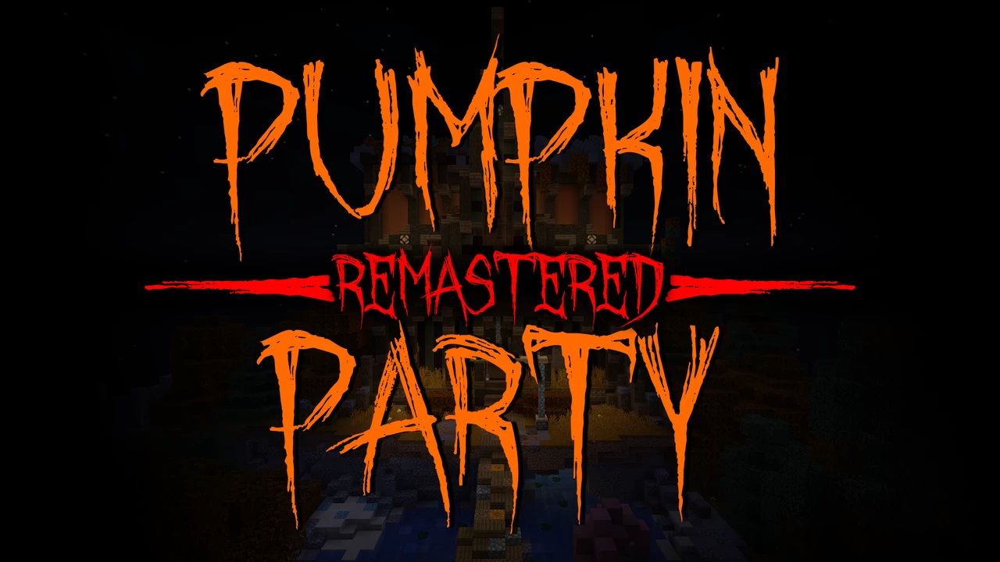
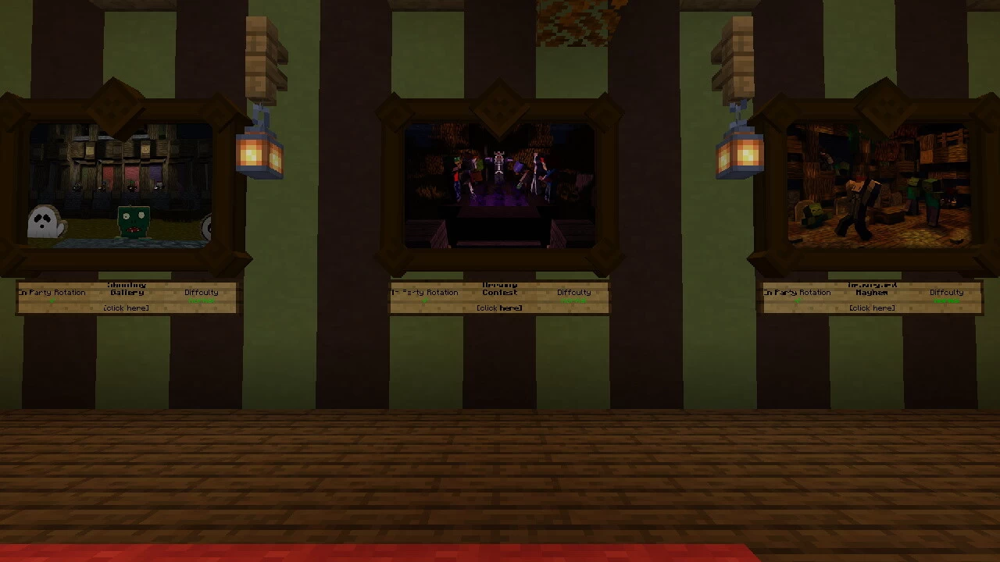

# Pumpkin.Party.Remastered-南瓜派对重制版

## 基本信息

**作者:** [Plagiatus](https://www.planetminecraft.com/member/plagiatus/)

**版本:** 1.20

**官方:** [PM](https://www.planetminecraft.com/project/pumpkin-party-remastered/)

完整标签（点击展开）

完整中文标签: 
`Challenge`, `迷你游戏集合`, `跑酷挑战`, `Party`, `迷你游戏`, `Halloween`, `Spider`, `Challenge Adventure`

原始标签（点击展开）

原始英文标签: 
`Challenge`, `Minigames`, `Parkour`, `Party`, `Minigame`, `Halloween`, `Spider`, `Challenge Adventure`

图片展示（点击展开）

## 介绍

### 南瓜派对重制版 🎃

欢迎来到焕然一新的南瓜派对世界！本作品是基于原版《南瓜派对》（1.10/1.11/1.12版本）精心重制的升级版本，在保留经典玩法的同时，带来了更丰富的游戏体验：

#### ✨ 全新特色

- **多元难度**：新增多级挑战模式
- **自定义设置**：支持个性化游戏参数调整
- **平衡优化**：全面改进游戏平衡性
- **精致设计**：重塑游戏机制与场景布局
- **百变装扮**：海量服饰任你搭配

#### 🎮 游戏概览

本地图包含**7款精彩小游戏**与海量服饰系统，支持单人与多人模式，带来持续数小时的欢乐体验！

**基础信息**

- 玩家人数：1人以上
- 适用版本：MC 1.16/1.17/1.19/1.20
- 特色内容：小游戏、服饰系统、糖果收集、彩蛋探索

#### 🚀 开始游戏

立即在免费服务器上体验：
`https://trial.stickypiston.co/map/pumpkinpartyremastered`

**游戏模式**

- 单独体验任意小游戏
- 开启派对模式，与好友展开七项游戏的终极对决

#### 📦 必备资源

本地图需加载专用资源包，您可以选择：

- 通过地图内置链接自动获取
- 手动下载对应版本：1.16 / 1.17 / 1.19 / 1.20

#### 🎯 游戏清单

- **蜘蛛竞速** - 敏捷与技巧的考验
- **南瓜雕刻**（最多11人） - 创意雕刻大赛
- **墓地狂欢** - 惊险刺激的夜间冒险
- **射击画廊**（最多11人） - 精准射击挑战
- **酿造大赛**（最多11人） - 魔药调制对决
- **不给糖就捣蛋** - 经典万圣节玩法
- **监守者巢穴**（1.19.2+） - 深层世界的终极试炼

#### 👥 开发团队

特别感谢 **Dragonmaster95**（Twitter, PMC）与本项目共同打造重制版本

#### ⚠️ 技术提示

使用第三方服务端（Bukkit/Spigot/Paper等）的玩家请注意：

**关键设置**

- 调整`spigot.yml`中的`entity-activation-range`参数，将misc项设置为160或视距的16倍
- 确保服务器设置中已启用命令方块功能

#### 📜 使用条款

**授权范围**
欢迎在视频、直播等创作中使用本地图，需在作品描述中完整标注以下信息：

**署名要求**

- 地图名称：南瓜派对重制版
- 制作团队：Plagiatus, dragonmaster95
- 下载地址：https://www.planetminecraft.com/project/pumpkin-party-remastered/
- 官方网站：https://plagiatus.net
- 推特账号：https://twitter.com/realplagiatus

**特别请求**
期待您在视频中展示我们的致谢区域，这是对开发团队辛勤付出的最好认可。若未遵守上述条款，我们保留对侵权内容提出主张的权利。

---

准备好与好友展开终极对决了吗？快来收集糖果、解锁服饰，在这个充满惊喜的南瓜世界里创造属于你们的传奇！🎊

原始介绍(点击展开)

This map is a remaster of the original Pumpkin Party (1.10/1.11/1.12), which significantly improves on the original map with more difficulties, more settings, better balancing, better gamedesign and MORE COSTUMES!!Pumpkin Party Remastered is a map featuring 7 minigames and lots of costumes, for hours of fun!1+ players, MC 1.16/1.17/1.19/1.20 versions availablePlay Pumpkin Party Remastered on a free Minecraft Serverhttps://trial.stickypiston.co/map/pumpkinpartyremasteredPlay the minigames individually or start a Party to compete against your friends in an epic showdown of all seven minigames.This map requires the use of a resource pack, which is linked inside the map for convenience. It can also be downloaded directly here: 1.16 / 1.17 / 1.19 / 1.20.2The seven minigames are:- Spider Run- Pumpkin Carving (max 11 players)- Graveyard Mayhem- Shooting Gallery (max 11 players)- Brewing Contest (max 11 players)- Trick or Treat- Warden's Lair (1.19.2+)This map has Costumes, Minigames, Candies, EasterEggs... Nothing more to be desired. Have fun competing with your friends :)Dragonmaster95 (twitter, PMC) worked with me to create the Remastered Version.Important information for players with third party server software (bukkit / spigot / paper / etc):The servers default settings might have a setting that causes armorstands to be unloaded very close to the player, which breaks at least two games. To fix it, in spigot.yml change entity-activation-range for misc to something large like 160, or 16 times your servers render distance (which should probably be at around 10). Also, make sure that commandblocks are turned on in the server settings.-------!!!!!!!!!!!!!!!!!!!!!!!-------Legal Notice and Terms of UsageYou're free to play the map in videos, livestreams or anything else,as long as you copy-paste the following credit into your video description:Mapname: Pumpkin Party RemasteredMapmaker: Plagiatus, dragonmaster95Mapdownload: https://www.planetminecraft.com/project/pumpkin-party-remastered/Mapmakers website: https://plagiatus.netMapmakers twitter: https://twitter.com/realplagiatus-------!!!!!!!!!!!!!!!!!!!!!!!-------It would also be nice of you to show our credits area in your video, we worked long and hard on this map, it's the least you can do.If you don't follow these rules, I reserve the right to claim your video (drastic I know, but some people just never learn...)

## 相关实况

[我的世界 南瓜派对PK战](https://www.bilibili.com/video/BV12MSeYuE6S)

## 游玩截图

暂无游玩截图
