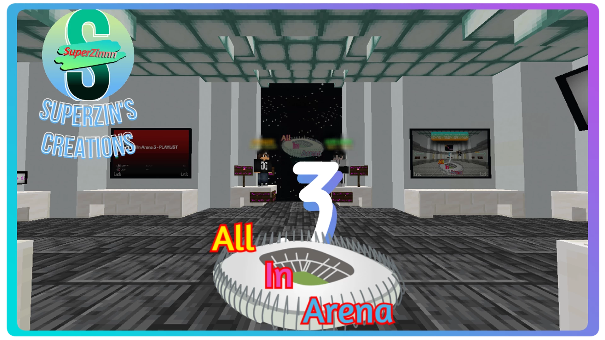
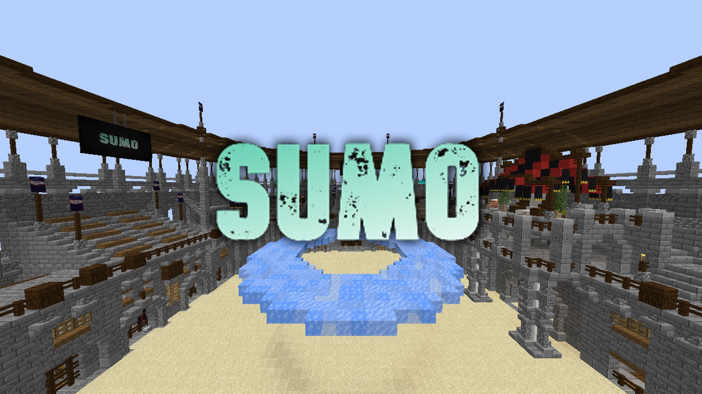

# All.In.Arena-全能竞技场

## 基本信息

**作者:** [SuperZinnn](https://www.planetminecraft.com/member/superzinnn/)

**版本:** 1.18.1

**官方:** [PM](https://www.planetminecraft.com/project/all-in-arena-3-0/)

**标签:** `PVP对战`

完整标签（点击展开）

完整中文标签: 
`Pvp`, `竞技场`, `Tag`, `Pvparena`, `Tntrun`, `Spleeg`, `Pigrace`, `Challenge Adventure`, `Playervsplayer`, `Smashmobs`, `Blockparty`, `Redlight`, `Greenlight`, `Minigamesmap`, `Holeinthewall`, `Findtheore`, `鱿鱼游戏小游戏`

原始标签（点击展开）

原始英文标签: 
`Pvp`, `Arena`, `Tag`, `Pvparena`, `Tntrun`, `Spleeg`, `Pigrace`, `Challenge Adventure`, `Playervsplayer`, `Smashmobs`, `Blockparty`, `Redlight`, `Greenlight`, `Minigamesmap`, `Holeinthewall`, `Findtheore`, `Squidgameminigame`

图片展示（点击展开）

## 介绍

### 全竞技场3 - 多人迷你游戏合集

**注意**：本地图需要安装 Optifine 模组方可正常运行。

---

#### 🎮 迷你游戏总览

##### 幸运矿工
- **玩法说明**：寻找隐藏的**金矿石**
- **参与人数**：1 - 无限
- **多人调整**：超过5名玩家时，**急迫药水**效果将被移除

##### 登顶挑战
- **玩法说明**：勇攀高峰，争夺制空权
- **参与人数**：1 - 无限

##### 相扑对决
- **玩法说明**：将对手推下竞技平台
- **参与人数**：2 - 无限

##### 红绿灯
- **玩法说明**：在"绿灯"指令期间快速前进
- **参与人数**：1 - 无限

##### 农场物语
- **玩法说明**：收集所有指定物品
- **参与人数**：1 - 7

##### 玻璃天桥
- **玩法说明**：安全抵达彼岸
- **参与人数**：1 - 无限
- **多人调整**：
  * 5人局：每位玩家3次机会
  * 10人局：每位玩家1次机会

##### 精准射击
- **玩法说明**：击中指定的目标
- **参与人数**：1 - 无限

##### 僵尸围城
- **玩法说明**：在尸潮中努力生存
- **参与人数**：1 - 无限

##### 方块派对
- **玩法说明**：在变幻的平台上保持生存
- **参与人数**：2 - 无限

##### 猪猪赛跑
- **玩法说明**：骑着爱猪冲向终点
- **参与人数**：1 - 7

##### 穿墙而过
- **玩法说明**：精准穿过墙壁的空隙
- **参与人数**：2 - 无限

##### 地砖破坏
- **玩法说明**：破坏对手脚下的方块
- **参与人数**：2 - 无限

##### 怪物大乱斗
- **玩法说明**：消灭所有生成的生物
- **参与人数**：1 - 无限

##### TNT跑酷
- **玩法说明**：在消失的方块上保持移动
- **参与人数**：2 - 无限

##### 竞技场追逐
- **玩法说明**：全力奔跑，躲避追捕！
- **参与人数**：2 - 无限

---

准备好迎接这场充满欢笑与激情的冒险了吗？召集你的伙伴，立即开启属于你们的竞技传奇！✨

原始介绍(点击展开)

MC 1.18.1Optifine required for this mapAll In Arena 3 is a place where you and your friends will fight in minigames, which vary from luck to skill, to find the best playerStickyPiston Hosting Link:https://trial.stickypiston.co/map/allinarena3MINIGAMESLucky MinerHow to PlayPlayers NeededMultiplayer ModificationsFind the gold ore1 - ♾️With more than 5 players, the potion of haste is not usedHit the TopHow to PlayPlayers NeededMultiplayer ModificationsHit the Top (duh)1 - ♾️-----SumoHow to PlayPlayers NeededMultiplayer ModificationsPush your enemies off the platform2 - ♾️-----Green Light, Red LightHow to PlayPlayers NeededMultiplayer ModificationsAdvance while the doll says "green light"1 - ♾️-----FarmHow to PlayPlayers NeededMultiplayer ModificationsGet all the items1 - 7-----Glass BridgeHow to PlayPlayers NeededMultiplayer ModificationsGet to the other side1 - ♾️With 5 players, everyone has 3 chancesWith 10 players, everyone has 1 chanceShoot'em UpHow to PlayPlayers NeededMultiplayer ModificationsShoot selected targets1 - ♾️-----Zombie ApocalypseHow to PlayPlayers NeededMultiplayer ModificationsAvoid dying1 - ♾️-----Block PartyHow to PlayPlayers NeededMultiplayer ModificationsAvoid dying2 - ♾️-----Pig RaceHow to PlayPlayers NeededMultiplayer ModificationsReach the end of the course with your pig1 - 7-----Hole in the WallHow to PlayPlayers NeededMultiplayer ModificationsGo through the holes in the wall2 - ♾️-----SpleegHow to PlayPlayers NeededMultiplayer ModificationsBreak the blocks under your enemies2 - ♾️-----Smash MobsHow to PlayPlayers NeededMultiplayer ModificationsKill the mobs1 - ♾️-----TNT RunHow to PlayPlayers NeededMultiplayer ModificationsDo not stop2 - ♾️-----Arena TagHow to PlayPlayers NeededMultiplayer ModificationsRUN!!2 - ♾️-----

## 相关实况

暂无相关实况信息

## 游玩截图

暂无游玩截图
