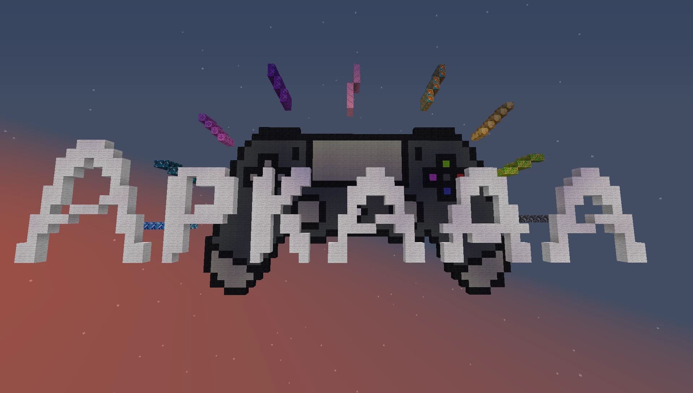

# Arcade.Russian-街机冒险

## 基本信息

**作者:** [Lopoilopikov](https://www.planetminecraft.com/member/lopoilopikov/)

**版本:** 1.20.4

**官方:** [PM](https://www.planetminecraft.com/project/-6027711/)

**标签:** `PVP对战`, `其他玩法`

原始标签（点击展开）

原始英文标签: 
`Pvp`, `Minecraft`, `Parkour`, `Minigame`, `Multiplayer`, `Challenge Adventure`, `Other`, `116map`, `117map`, `118map`, `119map`, `120map`

图片展示（点击展开）

## 介绍

### 街机模式

欢迎来到充满挑战与乐趣的**街机模式**！这是一个专为2至8名玩家设计的多人竞技舞台，您将与对手们在瞬息万变的小游戏中展开激烈角逐。每场游戏都将根据您的表现累积**积分**，率先达到设定目标的玩家将成为最终赢家！

#### 核心玩法特色

- **动态积分竞赛**  
  每场迷你游戏都会为您带来积分奖励，当有玩家达到预设的胜利分数时，游戏将迎来高潮并决出胜者！

- **丰富游戏组合**  
  模式中包含**10种核心迷你游戏**，每种游戏更暗藏惊喜——拥有**3种独特变体**！  
  例如在**跑酷**中您可能遇到不同布局的空中赛道，而在**雪地竞速**里冰雪障碍会以全新排列方式出现～

- **自由规则定制**  
  在游戏大厅中，您可以随心调整胜利所需积分，创造最适合当前队伍的挑战难度！

#### 迷你游戏全览

模式包含以下十大经典游戏（每个游戏均含三种变化形态）：

- **跑酷** - 在悬空平台间展现灵巧身法  
- **雪地竞速** - 穿越精心设计的冰雪障碍赛道  
- **僵尸突围** - 在成群僵尸中杀出重围  
- **雷区穿梭** - 谨慎踏出每一步生存之路  
- **山丘之王** - 占领制高点抵御所有挑战者  
- **精准射击** - 用子弹证明您的瞄准技术  
- **宝藏猎人** - 搜寻散落各处的珍贵宝物  
- **钢铁暴雨** - 在枪林弹雨中极限求生  
- **随机挑战** - 每次都是全新未知的体验  
- **相扑竞技** - 用纯粹力量将对手推出擂台

> 💡 温馨提醒：所有迷你游戏的详细说明均可在游戏大厅中查看，助您提前制定必胜策略！

原始介绍(点击展开)

ОписаниеРежим "Аркада" предназначена для игры от 2 до 8 людей одновременно. В данном режиме вам предстоит соревноваться с вашими оппонентами в быстро меняющихся играх, в каждой игре ты зарабатываешь очки, достигая определённого кол-ва очков, игра завершается а игрок набравший их побеждает. В режиме всего 10 разных мини-игр, у каждой из которых 3 вариации, например ПАРКУР может попасться несколько карт с паркуром, или СПЛИФ где снег расстановлен по разному. Карту можно настроить в лобби, до скольки очков играть. Краткое описание каждой мини-игры есть в лобби карты.Кол-во игроков: От 2 до 8Мини-игры: Паркур/Сплиф/Зомби/Минное поле/Царь горы/Выстрел/Сокровище/Железный дождь/Рандом/Сумо.Мини-настройки: В лобби можно поставить кол-во очков для победы в игре.

## 相关实况

暂无相关实况信息

## 游玩截图

暂无游玩截图
