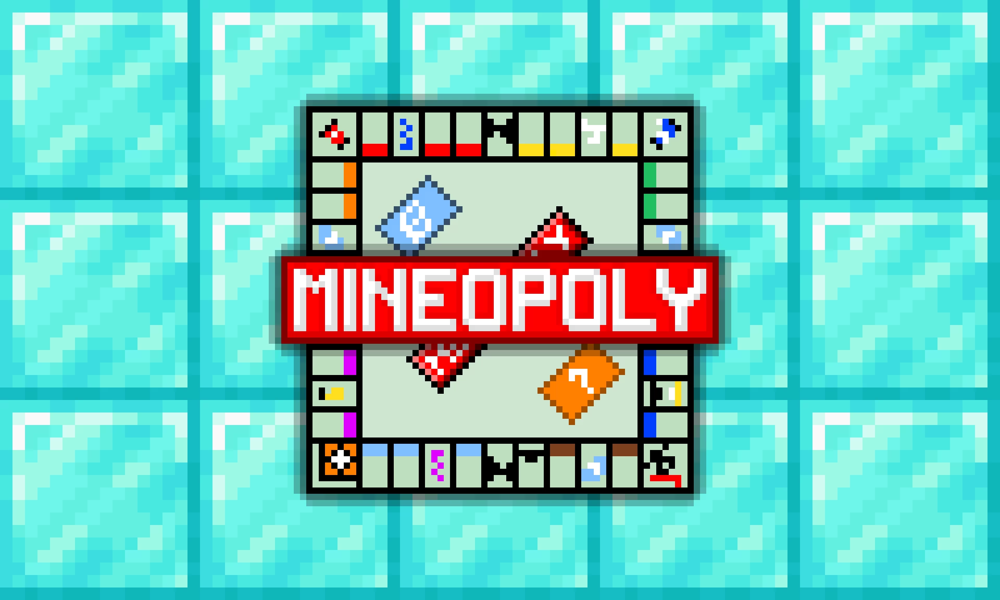
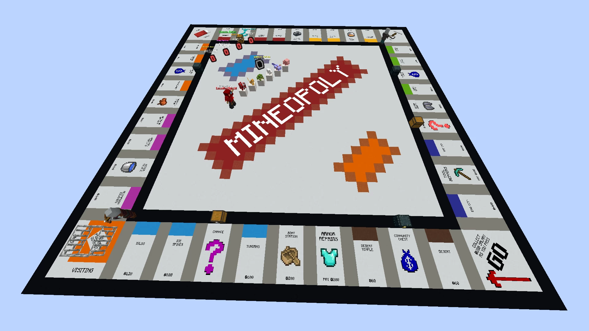

# Mineopoly.Monopoly-Minecraft大富翁

## 基本信息

**作者:** [CanadianHybrid](https://www.planetminecraft.com/member/canadianhybrid/)

**版本:** 1.20.4

**官方:** [PM](https://www.planetminecraft.com/project/mineopoly-monopoly-in-minecraft/)

图片展示（点击展开）

## 介绍

### 欢迎来到《MINEOPOLY》——我的世界版大富翁！

在《我的世界》中体验经典桌游《大富翁》的无限乐趣！《MINEOPOLY》完美复刻了原版游戏的核心玩法，并融入《我的世界》的独特风格，为您带来一场策略与运气的精彩对决。

#### 🎮 游戏特色

- **多人联机体验**：支持 **2 至 6 名玩家** 共同参与，内置完善的交易、拍卖与自定义**房规系统**，让每局游戏都充满变数！
- **经典玩法再现**：玩家通过掷骰子在地图上移动，购买未被其他玩家拥有的**地产**，或发起拍卖竞标。一旦拥有地产，其他玩家落脚时需支付**租金**。
- **策略升级机制**：集齐同色系的所有地产即可组成**颜色组合**，并建造**房屋**或**酒店**，大幅提升租金收入。
- **胜负判定方式**：当玩家无力偿还债务时即告出局。运用谈判技巧，与其他玩家交易**地产**与**资产**，成为最后的赢家！

#### 🌍 兼容性与支持

- 本地图专为 **《我的世界》1.20.4 版本** 设计，您可点击此处下载服务器文件。
- 喜欢《MINEOPOLY》并希望支持 **CanadianHybrid** 的后续创作？欢迎通过捐赠为我们助力！

一起加入这场充满策略与惊喜的方块世界大富翁之旅吧！🚀

原始介绍(点击展开)

Play Monopoly, in Minecraft!MINEOPOLY is a fully-functioning Minecraft adaptation of the classic board game Monopoly.The game supports 2-6 Players, and includes various built-in systems for handling trading, auctions, house rules, and more!How to PlayThe game starts with each token automatically rolling the dice to determine the turn order. After that, players take turns rolling the dice to travel around the board. Land on a property not yet purchased by another player, and you can buy it from the bank or put it up for auction. Once bought, other players will have to pay rent to the owner each time they land on said space.If a player owns all properties of the same colour, they complete the colour set and can build houses/hotels on their properties, increasing the rent other players pay when they land on the space.Players lose the game if they can no longer pay off their debt. Use your negotiating skills to trade properties and other assets with players to be the last one standing!The map is designed for Minecraft version 1.20.4. You can download the server jar here.Want to support MINEOPOLY and all future projects by CanadianHybrid?Consider Donating!

## 相关实况

暂无相关实况信息

## 游玩截图

暂无游玩截图
